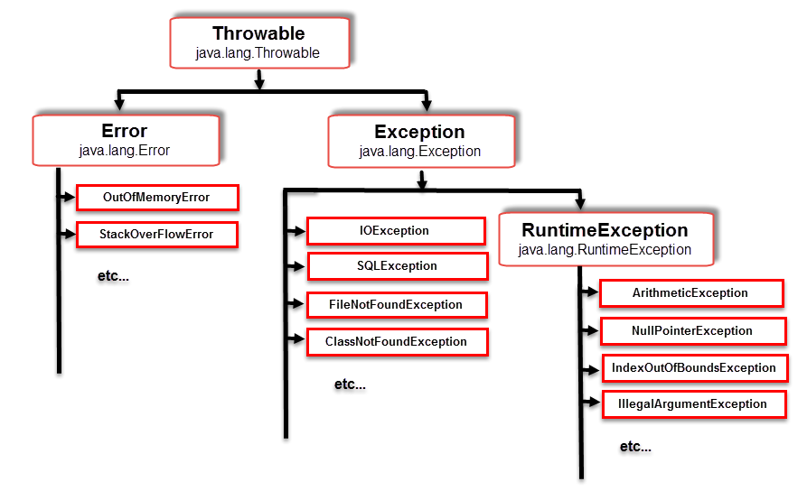

# [item 70] 복구할 수 있는 상황에는 검사 예외를, 프로그래밍 오류에는 런타임 예외를 사용하라

### 사전 조사

#### Error vs Exception
- 오류(Error)
    - 시스템에 비정상적인 상황이 생겼을 때 발생한다. 
    - 이는 시스템 레벨에서 발생하기 때문에 심각한 수준의 오류이다. 
    - 따라서 개발자가 미리 예측하여 처리할 수 없기 때문에, 애플리케이션에서 오류에 대한 처리를 신경 쓰지 않아도 된다.
    - ex) `OutOfMemoryError`, `StackOverflowError`
- 예외(Exception)
    - 개발자가 구현한 로직에서 발생한다. 
    - 즉, 예외는 발생할 상황을 미리 예측하여 처리할 수 있다. 
    - 즉, 예외는 개발자가 처리할 수 있기 때문에 예외를 구분하고 그에 따른 처리 방법을 명확히 알고 적용하는 것이 중요하다.

#### 예외 클래스 구조

- 모든 예외클래스는 `Throwable` 클래스를 상속받고 있으며, `Throwable`은 최상위 클래스 `Object`의 자식 클래스이다.
- `RuntimeException`은 **CheckedException**과 **UncheckedException**을 구분하는 기준이다.
    - `Exception`의 자식 클래스 중 `RuntimeException`을 제외한 모든 클래스는 **CheckedException**이며, `RuntimeException`과 그의 자식 클래스들을 **Unchecked Exception**이라 부른다.

#### Checked Exception과 Unchecked(Runtime) Exception
- 호출하는 쪽에서 복구하리라 여겨지는 상황이라면 검사 예외를 사용하라. 이것이 검사와 비검사 예외를 구분하는 기본 규칙이다.
- **검사 예외(Checked Exception)**
    - 반드시 예외를 처리해야 한다.
        - `try/catch`로 감싸거나 `throw`로 던져서 처리해야 한다.
    - 컴파일 단계에서 확인 가능하다.
    - 예외 발생 시 트랜잭션을 roll-back 하지 않는다.
    - ex) `IOException`
- **비검사 예외(Unchecked(Runtime) Exception)**
    - 실행과정 중 어떠한 특정 논리에 의해 발견되는 Exception이다.
    - 명시적인 처리를 강제하지 않는다.
        - 피할 수 있지만 개발자가 부주의해서 발생하는 경우가 대부분이고, 미리 예측하지 못했던 상황에서 발생하는 예외가 아니기 때문에 굳이 로직으로 처리를 할 필요가 없도록 만들어져 있다.
    - 런타임에 확인 가능하다.
        - 컴파일 단계에서 확인할 수 없는 예외라 하여 Unchecked Exception이며, 실행과정 중 발견된다 하여서 Runtime Exception이라 한다.
    - 예외 발생 시 트랜잭션을 roll-back 한다.
    - ex) `NullPointerException`, `IllegalArgumentException`, `IndexOutOfBoundException`
- 트랜잭션의 roll-back 여부
    - 기본적으로 **Checked Exception**은 예외가 발생하면 트랜잭션을 roll-back하지 않고 예외를 던져준다. 
    - 하지만 **Unchecked Exception**은 예외 발생 시 트랜잭션을 roll-back한다는 점에서 차이가 있다.
    - 트랜잭션의 전파방식 즉, 어떻게 묶어놓느냐에 따라서 **Checked Exception**이냐 **Unchecked Exception**이냐의 영향도가 크다. 
    - roll-back이 되는 범위가 달라지기 때문에 개발자가 이를 인지하지 못하면, 실행결과가 맞지 않거나 예상치 못한 예외가 발생할 수 있다. 
    - 그러므로 이를 인지하고 트랜잭션을 적용시킬 때 전파방식(propagation behavior)과 롤백규칙 등을 적절히 사용하면 더욱 효율적인 애플리케이션을 구현할 수 있을 것이다.

## Reference
- [Java 예외(Exception) 처리에 대한 작은 생각](http://www.nextree.co.kr/p3239/)
- [자바 Exception 예외 (throwable, Error, Exception, RuntimeException)](https://meaownworld.tistory.com/86)

---

### 스터디 요약
-
---

> :leftwards_arrow_with_hook:[EffectiveJava3E](/EffectiveJava3E/README.md)

