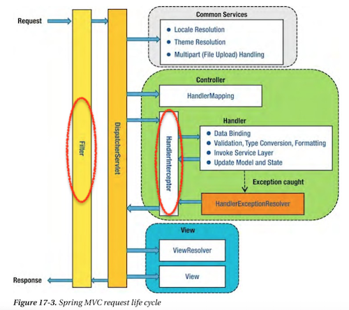

# CHAPTER 4. 스프링 시큐리티

## :heavy_check_mark: hasRole 과 hasAuthority 의 차이 및 사용법
### hasRole

### hasAuthority
 
#### :link: Reference
- []()


## :heavy_check_mark: 암호화 알고리즘의 종류 및 장단점 
### 암호화의 종류
1. 대칭형 암호 (비밀키 암호)
    - 암호화 키와 복호화 키가 같다
2. 비대칭형 암호 (공개키 암호)
    - 암호화키와 복호화키다 다르다
3. 단방향 암호
    - 암호화는 가능하지만 복호화는 불가능하다

### 단방향 암호
패스워드에 사용되는 암호화는 단방향 암호가 많다. 책에서 소개된 Bcrypt나 PBKDF2도 단방향 암호. 

패스워드가 복호화 될 수 있다는 것 자체가 이미 노출될 가능성을 안고 있다. 따라서 원본 데이터로 복원 성질이 애초에 존재하지 않는 해시함수 비밀번호를 저장하는데 사용된다.


### Password network 전송 시 보안

위에서 이야기한 것들이 수신한 패스워드 저장 측면에서의 보안이고, 클라이언트 부터 서버까지 데이터 전송에 대한 보안도 따로 필요할 것이다. 이때 알아야하는 것이 SSL/TLS 기반의 https이다.

그리고 여기서 RSA등의 비대칭키 암호화 및 대칭키 암호화 기술을 이용한 PKI 기반으로 클라이언트/서버 사이에 전송되는 데이터가 암/복호화 된다.

#### :link: Reference
- [_JSPark - 암호화 알고리즘 종류](https://jusungpark.tistory.com/34)
- [OKKY - (어느 암호화와 질문 관련 답변)](https://okky.kr/article/524872?note=1567285)


## :heavy_check_mark: 단방향, 양방향 암호화 
### 동일한 raw String password 에 대한 양방향 암호화 결과값은 항상 동일한가?

#### :link: Reference
- []()


## :heavy_check_mark: LDAP 이란 
### LDAP 의 개념

### *.ldif 설정 파일 사용법

### LDAP의 장단점 

#### :link: Reference
- []()


## :heavy_check_mark: @Bean, @Component 의 차이 
- `@Bean`
  - 개발자가 컨트롤이 불가능한 외부 라이브러리들을 Bean으로 등록하고 싶은 경우에 사용
  - ObjectMapper의 경우 ObjectMapper Class에 `@Component`를 선언할 수 없으니 ObjectMapper의 인스턴스를 생성하는 메서드를 만들고 해당 메서드에 `@Bean`을 선언하여 Bean으로 등록한다.
- `@Component`
  - 개발자가 직접 컨트롤이 가능한 Class를 Bean으로 등록하고 싶은 경우에 사용
- 개발자가 생성한 Class에 `@Bean` 선언이 가능할까?
  - 불가능하다.
  - `@Bean`과 `@Component`는 각자 선언할 수 있는 타입이 정해져있어 해당 용도외에는 컴파일 에러를 발생시킨다.
    - `@Bean`
      ```java
      @Target({ElementType.METHOD, ElementType.ANNOTATION_TYPE})
      @Retention(RetentionPolicy.RUNTIME)
      ...
      public @interface Bean {
        ...
      }
      ```
    - `@Component`
      ```java
      @Target(ElementType.TYPE)
      @Retention(RetentionPolicy.RUNTIME)
      ...
      public @interface Component {
        ...
      }
      ```
    - `ElementType`
      ```java
      public enum ElementType {
        /** Class, interface (including annotation type), or enum declaration */
        TYPE,

        /** Field declaration (includes enum constants) */
        FIELD,

        /** Method declaration */
        METHOD,

        /** Formal parameter declaration */
        PARAMETER,

        /** Constructor declaration */
        CONSTRUCTOR,

        /** Local variable declaration */
        LOCAL_VARIABLE,

        /** Annotation type declaration */
        ANNOTATION_TYPE,

        /** Package declaration */
        PACKAGE,

        /**
        * Type parameter declaration
        *
        * @since 1.8
        */
        TYPE_PARAMETER,

        /**
        * Use of a type
        *
        * @since 1.8
        */
        TYPE_USE,

        /**
        * Module declaration.
        *
        * @since 9
        */
        MODULE
      }
      ```
  #### :link: Reference
  - [@Bean vs @Component](https://jojoldu.tistory.com/27)

  ## :heavy_check_mark: 경로 /** 표시의 의미
  ### /** 와 /* 의 차이 

  - Ant Pattern
  - Ant Pattern의 종류
    - ? : 1개의 문자와 매칭
    - \* : 0개 이상의 문자와 매칭
    - ** : 0개 이상의 디렉토리와 파일 매칭
    ```
    antPathMatcher.match("/static/**", "/static/images/user/123.jpg"); => true
    antPathMatcher.match("/static/**", "/static/images/");             => true
    antPathMatcher.match("/static/**", "/static");                     => true
    antPathMatcher.match("/static/**", "/stat/images");                => false
    
    antPathMatcher.match("/static/*", "/static/123.jpg");              => true
    antPathMatcher.match("/static/*", "/static/images/123.jpg");       => false
    antPathMatcher.match("/static*/*", "/static/123.jpg");             => true
    antPathMatcher.match("/static*/*", "/staticABC/123.jpg");          => true
    
    antPathMatcher.match("/static*/*", "/staticABC/images/123.jpg");   => false
    antPathMatcher.match("/static*/**", "/staticABC/images/123.jpg");  => true
    
    antPathMatcher.match("/static?/**", "/staticA/images/123.jpg");    => true
    antPathMatcher.match("/static?/**", "/static/images/");            => false
    antPathMatcher.match("/static?/*", "/staticB/123.jpg");            => true
    antPathMatcher.match("/static?/???.jpg", "/staticB/123.jpg");      => true
    antPathMatcher.match("/static?/???.jpg", "/staticB/1234.jpg");     => false
    ```

  #### :link: Reference
  - [Ant style pattern 정리](https://lng1982.tistory.com/169)


  ## :heavy_check_mark: 스프링 시큐리티와 인터셉터, 필터
  ### 스프링 시큐리티와 인터셉터 모두 있을 때 적용되는 순서 

  - 스프링 시큐리티는 필터 기반이기 때문에 시큐리티가 우선 적용
  
  - 요청이 들어오면 필터를 거친 후, 인터셉터 처리
  - 시큐리티를 적용하지 않을 경우 세션과 인터셉터를 이용해 권한 관리와 같은 로직을 직접 구현해야 했지만 시큐리티 적용 시 설정으로 적용 가능 

  ### 인터셉터와 필터의 차이 

  - 실행 시점
    - 요청이 들어오면 필터 -> 인터셉터
    - 응답 시 인터셉터 -> 필터
  - 등록 위치
    - 필터는 웹 애플리케이션에 등록(web.xml)
      - 인코딩 변환, XSS 방어 처리 등
      - 스프링과 무관한 자원에 대해 동작 가능
      - 등록 위치 특성상 애플리케이션에 전역적으로 적용할 기능 구현
    - 인터셉터는 스프링의 context에 등록
      - 스프링 Dispatcher servlet이 컨트롤러 호출 전, 후에 동작
      - 스프링의 모든 빈 객체에 접근 가능
  - 인터페이스
    - 필터
      ```
      public interface Filter {
        void doFilter(ServletRequest request, ServletResponse response, FilterChain chain);
      }
      ```
    - 인터셉터
      ```
      public interface HandlerInterceptor {
        boolean preHandle(HttpServletRequest request, HttpServletResponse response, Object handler);
        void postHandle(HttpServletRequest request, HttpServletResponse response, Object handler, ModelAndView mav);
        void afterCompletion(HttpServletRequest request, HttpServeletResponse response, Object handler, Exception ex);
      }
    ```

#### :link: Reference
- [Authentication/Authorization 기능 구현(1) - interceptor vs spring security](https://soon-devblog.tistory.com/4?category=1026232)
- [SpringMVC Request Life Cycle에 대해 - PART 1](https://nesoy.github.io/articles/2019-02/Spring-request-lifecycle-part-1)
- [(Spring)Filter와 Interceptor의 차이](https://supawer0728.github.io/2018/04/04/spring-filter-interceptor/)
- [[Spring] Filter, Interceptor, AOP 차이 및 정리](https://goddaehee.tistory.com/154)

## :heavy_check_mark: Principal, Authentication, @AuthenticationPrincipal 의 개념 및 차이 

#### :link: Reference
- []()


## :heavy_check_mark: SecurityContextHolder 란 

#### :link: Reference
- []()


---

### :house: [SpringInAction Home](https://github.com/WeareSoft/wwl/tree/master/SpringInAction)
