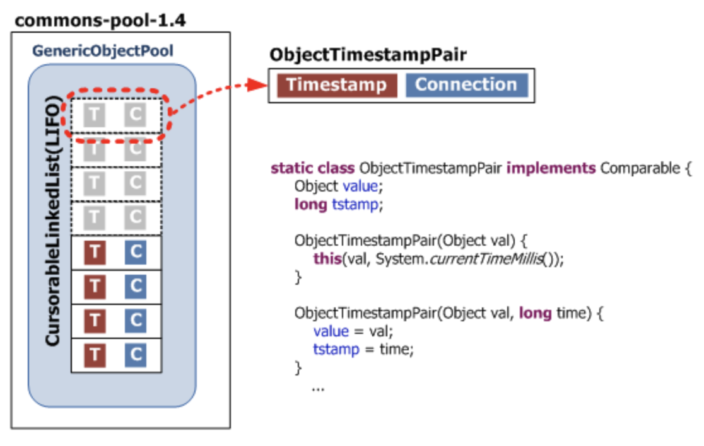

# CHAPTER 5. 구성 속성 사용하기
## :heavy_check_mark: 원천속성의 차이 및 우선순위
- JVM System Property란?
    - 시스템 프로퍼티는 JVM이 시작할 때 자동으로 설정되는 시스템 속성값
```
"file.separator"	Character that separates components of a file path. This is "/" on UNIX and "\" on Windows.
"java.class.path"	Path used to find directories and JAR archives containing class files. Elements of the class path are separated by a platform-specific character specified in the path.separator property.
"java.home"	Installation directory for Java Runtime Environment (JRE)
"java.vendor"	JRE vendor name
"java.vendor.url"	JRE vendor URL
"java.version"	JRE version number
"line.separator"	Sequence used by operating system to separate lines in text files
"os.arch"	Operating system architecture
"os.name"	Operating system name
"os.version"	Operating system version
"path.separator"	Path separator character used in java.class.path
"user.dir"	User working directory
"user.home"	User home directory
"user.name"	User account name
```

#### System.getenv도 있는데 property랑 뭐가 다르지?
- System.getenv를 통해 환경변수도 받을 수 있다.
- Property랑 환경변수랑 뭐가 다르지?
    - Property는 JVM내에서 사용하고 종료된다.
        - Application에 의존적이다.
        - 따른 Application에서 사용할 수 없다.
    - 환경변수는 OS에 적재된 변수다.
        - System.setenv 메소드가 없다.
        - OS 전체적으로 영향을 미친다.
    - 따라서 JVM에서 초기화하고 종료처리까지 할 목적이면 Property를 사용하는게 올바르다고 볼 수 있다.

#### Spring의 외부 설정 순서에 대해
- <https://docs.spring.io/spring-boot/docs/2.3.0.RELEASE/reference/html/spring-boot-features.html#boot-features-external-config>
- ConfigurationPropertiesBindingPostProcessor
- Last Win

#### 다양한 Annotation
- @ConfigurationProperties
    - 설정들을 읽어 Bean으로 변환하는 책임을 가지고 있다.
- @PropertySource
    - 외부 설정파일들을 읽어들일 수 있다.
    - SpringBoot Level에서는 추천하지 않는 방법이다.
- @Value
    - 설정의 값을 주입할 수 있다.

#### :link: Reference
- <https://docs.oracle.com/javase/tutorial/essential/environment/sysprop.html>
- <https://www.baeldung.com/java-system-get-property-vs-system-getenv>
- <https://mkyong.com/spring-boot/spring-boot-configurationproperties-example/>
- <https://kingbbode.tistory.com/39>

### JVM 시스템 속성 사용 예시
#### JVM System Property 간단한 사용방법
- JUnit5에서 사용하는 Condition관련 테스트에서 활용이 가능하다.
- <https://github.com/NESOY/junit5-example/blob/master/src/test/java/conditional/CustumConditionsTest.java>
- 따로 원하는 Property값을 넣을 수 있다.
    - `System.setProperty("wwl.spring.in.action", "2020");`


## :heavy_check_mark: 명령행 인자로 애플리케이션 실행 방법
<!-- + 기본적인 속성, 옵션들 정리 -->
- 사용법
  - 클래스 실행 : ```java [옵션] <기본 클래스> [args...]```
  - jar 실행 : ```java [옵션] -jar <jar 파일> [args...]>```
  - 모듈의 기본 클래스 실행 : ```java [옵션] -m <모듈>[/<기본 클래스>] [args...]```
  - 옵션의 종류
    - -cp or -classpath or --class-path <디렉토리 및 zip/jar 파일의 클래스 검색 경로>
      - 응용 프로그램 클래스 및 자원의 클래스패스 설정
      - 클래스 파일을 검색하기 위한 디렉토리, JAR, ZIP 파일을 : 으로 구분하여 입력
      - 예) ```-cp .:./subdir:./ex.jar```
    - -D<이름>=<값>
      - 시스템 속성을 설정
      - 예) ```-Dspring.profiles.active=dev```
    - -agentlib:<libname>=\[<options>]
      - 원시 에이전트 라이브러리를 로드 (추가 옵션은 -agentlib:jdwp=help)
      - 예) ```-agentlib:jdwp=transport=dt_socket,server=y,suspend=y,address=*:1044```

#### :link: Reference
- []()

## :heavy_check_mark: 톰캣의 JDBC 커넥션 풀, `HikariCP`, `Commons DBCP2`의 개념과 차이
<!-- (p171) -->
- 데이터베이스와 애플리케이션을 효율적으로 연결하기 위해, 동시 접속자가 가질 수 있는 Connection을 하나로 모아놓고 관리한다.
- 라이브러리로 Apache의 Commons DBCP와 Tomcat-JDBC, BoneCP, HikariCP 등이 있다.
### tomcat jdbc pool
- Tomcat 6 까지는 DBCP 를 Connection Pool 라이브러리로 쓰다가  7부터 Tomcat-JDBC로 변경
  > The JDBC Connection Pool `org.apache.tomcat.jdbc.pool` is a replacement or an alternative to the Apache Commons DBCP connection pool.
### Commons DBCP2

- 저장 구조
  - Commons DBCP는 `PoolableConnection` 타입의 커넥션을 생성하고 생성한 커넥션에 `ConnectionEventListener`를 등록한다.
    - `ConnectionEventListener`에는 애플리케이션이 사용한 커넥션을 풀로 반환하기 위해 JDBC 드라이버가 호출할 수 있는 콜백 메서드가 있다.
  - 이렇게 생성된 커넥션은 commons-pool의 `addObject()` 메서드로 커넥션 풀에 추가된다.
    - 이때 commons-pool은 내부적으로 현재 시간을 담고 있는 타임스탬프와 추가된 커넥션의 레퍼런스를 한 쌍으로 하는 `ObjectTimestampPair`라는 자료구조를 생성한다.
    - LIFO(last in first out) 형태의 `CursorableLinkedList`로 관리한다.
- 커넥션 개수 관련 속성
  - initialSize
    - BasicDataSource 클래스 생성 후 최초로 `getConnection()` 메서드를 호출할 때 커넥션 풀에 채워 넣을 커넥션 개수
  - maxActive
    - 동시에 사용할 수 있는 최대 커넥션 개수 (기본값: 8)
  - maxIdle
    - 커넥션 풀에 반납할 때 최대로 유지될 수 있는 커넥션 개수 (기본값: 8)
  - minIdle
    - 최소한으로 유지할 커넥션 개수 (기본값: 0)
  - maxConnLifetimeMillis
    - 커넥션의 최대 라이프타임을 지정
### HikariCP
- 스프링부트 2.0부터 기본 JDBC connection pool
- 커넥션 개수 관련 속성
  - connectionTimeout
    - pool에서 커넥션을 얻어오기 전까지 기다리는 최대 시간
    - 허용 가능한 wait time을 초과하면 SQLException을 던짐
    - 최소값은 250ms (기본값: 30000(30s))
  - idleTimeout
    - pool에 일을 하지 않는 커넥션을 유지하는 시간
    - 최소값은 10000ms (기본값: 600000(10minutes))
  - maxLifetime
    - 커넥션 풀에서 살아있을 수 있는 커넥션의 최대 수명시간 (기본값: 1800000(30minutes))
    - 사용중인 커넥션은 maxLifetime에 상관없이 제거 되지 않음
  - minimumIdle
    - 아무런 일을 하지않아도 적어도 이 옵션에 설정 값 size로 커넥션들을 유지 (기본값: same as maximumPoolSize)
  - maximumPoolSize
    - pool에 유지시킬 수 있는 최대 커넥션 수 (기본값: 10)
### 성능

- HikariCP
  - Bytecode-level engineering
  - Intelligent use of the Collections framework
    - *ArrayList<Statement>*, custom class *FastList*

#### :link: Reference
- [Apache Tomcat 7](https://tomcat.apache.org/tomcat-7.0-doc/jdbc-pool.html)
- [Commons DBCP 이해하기](https://d2.naver.com/helloworld/5102792)
- [HikariCP 뜯어보기 1편](https://brunch.co.kr/@jehovah/24)
- [HikariCP 뜯어보기 2편](https://brunch.co.kr/@jehovah/25)
- [Introduction to HikariCP](https://www.baeldung.com/hikaricp)

## :heavy_check_mark: HTTPS란
<!-- (p173) -->
### HTTP (Hypertext Transfer Protocol)
- 인터넷 상에서 **텍스트 정보**를 주고 받기위한 프로토콜
- 클라이언트와 서버 사이에 이루어지는 요청/응답 프로토콜
- 암호화되지 않은 방법으로 데이터를 전송한다. (악의적인 감청, 데이터 변조의 가능성)

### HTTPS (Hypertext Transfer Protocol **Over Secure Socket Layer**)
- 보안이 강화된 HTTP
- 모든 HTTP 요청과 응답 데이터는 네트워크로 보내지기 전에 암호화된다
- HTTPS는 HTTP의 하부에 SSL과 같은 보안계층을 제공함으로써 동작한다

### SSL (Secure Socket Layer)
- HTTPS에서 보안을 위해 사용되는 프로토콜
  - 네스케이프에 의해서 SSL이 발명되었고, 이것이 점차 폭넓게 사용되다가 표준화 기구인 IETF의 관리로 변경되면서 TLS(Transport Layer Security Protocol)라는 이름으로 바뀌었다
  - TLS 1.0은 SSL 3.0을 계승했지만 TLS라는 이름보다 SSL이라는 이름이 훨씬 많이 사용된다
- Certificate Authority(CA)라 불리는 서드 파티로부터 서버와 클라이언트의 인증을 하는데 사용된다


### SSL 인증서
- SSL 인증서는 클라이언트와 서버간의 통신을 제3자가 보증해주는 전자화된 문서
- 클라이언트가 서버에 접속한 직후에 서버는 클라이언트에게 이 인증서 정보를 전달하게 된다
- 클라이언트는 이 인증서 정보가 신뢰할 수 있는 것인지를 검증 한다

### 통신 과정
#### 서버(웹)에서 HTTPS 통신 방식을 제공하기 위한 과정
- 1: HTTPS 통신 방식을 위해 CA(Certificate Authority)로부터 인증서를 구입하게 된다.이 때 웹은 서비스의  도메인과 서버 공개키 정보를 제출한다
  - (CA는 민간기업이지만 아무나 운영할 수 없고 신뢰성이 검증된 기업만 CA를 운영할 수 있음)
- 2: CA는 서비스의 정보를 비공개키를 이용하여 암호화한다
- 3, 4: 웹은 CA로부터 암호화된 SSL 인증서를 제공받는다

#### 브라우저가 HTTPS 통신을 하는 과정
- 5: 브라우저는 서버와 데이터를 주고 받기 전, 가장 먼저 웹으로부터 SSL 인증서를 받게  된다
   - (브라우저는 내부적으로 CA의 리스트를 파악하고 있으며 CA의  공개키에 대한 정보도 대부분 알고 있다)
- 6 브라우저는 웹 서버로부터 받은 인증서를 CA의 공개키를 이용해 복호화한다
- 7: 성공한다면 인증서가 CA의 비공개키에 의해 암호화된 것을 의미하며, 이 사이트는 신뢰할  수 있다는 것으로 생각하면 된다
  - 복호화에 실패한다면 신뢰할 수 없는 사이트로 간주한다
- 이 일련의 과정을 SSL 핸드쉐이크라고 하며, 그 과정은...
  - [쉬운 설명](https://wayhome25.github.io/cs/2018/03/11/ssl-https/)
  - [세세한 설명](https://12bme.tistory.com/80)
  - [위키](https://en.wikipedia.org/wiki/Transport_Layer_Security#Client-authenticated_TLS_handshake)

#### SSL 동작방법
- 공개키 암호 방식은 알고리즘 계산방식이 느린 경향이 있다
- 따라서 SSL은 암호화된 데이터를 전송하기 위해서 공개키와 대칭키 암호화 방식을 혼합하여 사용한다
- 안전한 의사소통 채널을 수립할 때는 공개키 암호를 사용하고, 이렇게 만들어진 안전한 채널을 통해서 임시의 무작위 대칭키를 생성 및 교환한다. 해당 대칭키는 나머지 데이터 암호화에 활용한다


> - 실제 데이터 암호화 방식: 대칭키
> - 상기 대칭키를 서로 공유하기 위한 암호화 방식: 공개키

### keystore
- keytool
  - Java SDK와 함께 배포되며 bin 디렉토리에 있는 보안 관련 프로그램
  - Java Key Store(JKS) 생성 및 관리
  - 공개키(public key), 개인키(private key)를 생성할 수 있으며 인증서 발급이 가능
- keystore
  - 키를 저장하는 파일(데이터베이스)
- 관련 용어(참고용)
  - JSSE (Java Secure Socket Extension)
  - KeyStore와 TrustStore

#### :link: Reference
- HTTPS
  - https://shxrecord.tistory.com/168
  - https://jeong-pro.tistory.com/89
  - https://12bme.tistory.com/80
  - https://wayhome25.github.io/cs/2018/03/11/ssl-https/
  - https://zero-gravity.tistory.com/199
- keystore
  - https://www.lesstif.com/java/java-keytool-keystore-20775436.html
  - http://btsweet.blogspot.com/2014/06/tls-ssl.html

## :heavy_check_mark: `logback.xml`과 `logback-spring.xml`의 차이
- 스프링 부트 애플리케이션에서는 logback.xml이나 logback-spring.xml 파일을 프로젝트 클래스패스에 추가하여 로깅 설정 가능
- 로깅 커스터마이징을 할 경우, 스프링 부트 개발팀은 설정 파일명에 -spring 붙이는 것을 권장
  - logback.xml 사용 시 스프링 부트가 로그 초기화를 완전히 제어하지 못할 수 있기 때문
  - logging은 ApplicationContext 생성 전에 초기화되기 때문에 스프링 @Configuration 파일의 @PropertySource에서 로깅 제어 불가능

#### :link: Reference
- [Using Logback with Spring Boot](https://springframework.guru/using-logback-spring-boot/)
- [4.6 Custom Log Configuration](https://docs.spring.io/spring-boot/docs/current/reference/html/spring-boot-features.html#boot-features-custom-log-configuration)


## :heavy_check_mark: DB connection pool (DBCP) 이란
#### 웹 어플리케이션을 지탱하는 WAS에서 DB 서버에 접근을 시작하고 데이터를 가져오기까지의 단계
1. DB 서버 접속을 위해 JDBC 드라이버를 로드한다.
2. DB 접속 정보와 DriverManager.getConnection() Method를 통해 DB Connection 객체를 얻는다.
3. Connection 객체로 부터 쿼리를 수행하기 위한 PreparedStatement 객체를 받는다.
4. executeQuery를 수행하여 그 결과로 ResultSet 객체를 받아서 데이터를 처리한다.
5. 처리가 완료되면 처리에 사용된 리소스들을 close하여 반환한다.

- 웹 애플리케이션은 HTTP 요청에 따라 Thread를 생성하게 되고 대부분의 비지니스 로직은 DB 서버로 부터 데이터를 얻게 된다.
- 만약 위와 같이 모든 요청에 대해 DB접속을 위한 Driver를 로드하고 Connection 객체를 생성하여 연결한다면 물리적으로 DB 서버에 지속적으로 접근해야 될 것이다.
- 이러한 상황에서 DB Connection 객체를 생성하는 부분에 대한 비용과 대기 시간을 줄이고, 네트워크 연결에 대한 부담을 줄일수 있는 방법이 있는데 바로, DBCP(Database Connection Pool)를 이용하면 이러한 문제를 해결할 수가 있다.

### DBCP(Database Connection Pool)
- Connection Pool은 DB와 미리 connection을 해놓은 객체들을 pool에 저장해두었다가, 클라이언트 요청이 오면 커넥션을 빌려주고, 볼일이 끝나면 다시 커넥션을 반납받아 pool에 저장하는 방식을 말한다.
- HTTP 요청에 매번 위의 1-5의 단계를 거치치 않기 위한 방법이다.
  - Connection ~ Close 까지의 반복 작업이 비효율적
- Connection Pool을 이용하면 다수의 HTTP 요청에 대한 Thread를 효율적으로 처리할 수 있게 된다.

#### Connection Pool의 구현체의 역할
- WAS가 실행되면서 미리 일정량의 DB Connection 객체를 생성하고 Pool 이라는 공간에 저장해 둔다.
- HTTP 요청에 따라 필요할 때 Pool에서 Connection 객체를 가져다 쓰고 반환한다.
- 이와 같은 방식으로 HTTP 요청 마다 DB Driver를 로드하고 물리적인 연결에 의한 Connection 객체를 생성하는 비용이 줄어들게 된다.


#### :link: Reference
- [DB Connection Pool에 대한 이야기](https://www.holaxprogramming.com/2013/01/10/devops-how-to-manage-dbcp/)
- [한국 데이터 산업 진흥원 - Connection pool 이란 ?](https://www.kdata.or.kr/info/info_04_view.html?field=&keyword=&type=techreport&page=18&dbnum=183740&mode=detail&type=techreport)
- [DB Connection Pool과 JDBC](https://technet.tmaxsoft.com/upload/download/online/jeus/pver-20170202-000001/server/chapter_datasource.html)
- [JDBC, JPA/Hibernate, Mybatis의 차이](https://gmlwjd9405.github.io/2018/12/25/difference-jdbc-jpa-mybatis.html)
- [Spring JDBC를 이용한 데이터 접근 방법](https://gmlwjd9405.github.io/2018/05/15/setting-for-db-programming.html)

---

### :house: [SpringInAction Home](https://github.com/WeareSoft/wwl/tree/master/SpringInAction)
