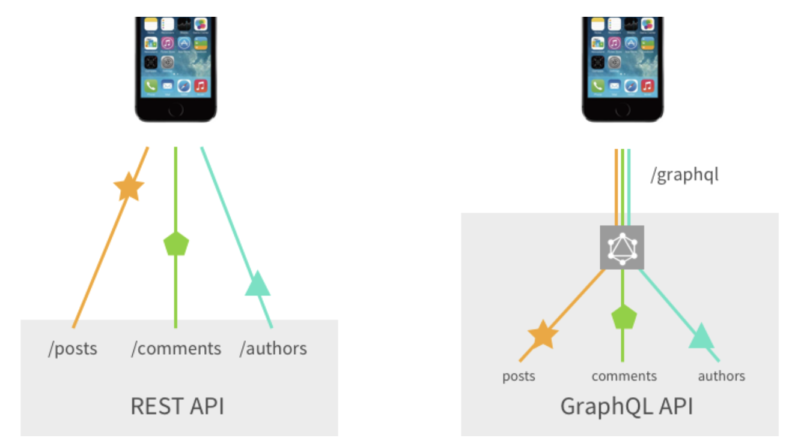

# CHAPTER 6. REST 서비스 생성하기 - CHAPTER 7. REST 서비스 사용하기
## :heavy_check_mark: `ResponseEntity`
### ResponseEntity
- HttpEntity의 확장된 객체이다.
    - HttpStatus 코드를 추가하여 반환할 수 있다.

- Controller에서 반환이 가능하다.
```java
 @RequestMapping("/handle")
 public ResponseEntity<String> handle() {
   URI location = ...;
   HttpHeaders responseHeaders = new HttpHeaders();
   responseHeaders.setLocation(location);
   responseHeaders.set("MyResponseHeader", "MyValue");
   return new ResponseEntity<String>("Hello World", responseHeaders, HttpStatus.CREATED);
 }
```

- static으로도 생성할 수 있다.
```java
@RequestMapping("/handle")
public ResponseEntity<String> handle() {
	URI location = ...;
	return ResponseEntity.created(location).header("MyResponseHeader", "MyValue").body("Hello World");
}
```

#### :link: Reference
- <https://docs.spring.io/spring/docs/current/javadoc-api/org/springframework/http/ResponseEntity.html>

## :heavy_check_mark: CORS, `@CrossOrigin`
### CORS (Cross-Origin Resource sharing)
- HTTP 헤더를 추가해 내 도메인(origin)에서 다른 도메인에 있는 리소스에 접근 가능하게 하고, 다른 리소스에서 내 도메인의 리소스에 접근하지 못하게 제한
- SOP (Same Origin Policy)와 반대 개념

### 스프링 @CrossOrigin
- 스프링 제공 어노테이션
- CORS를 스프링을 통해 설정 가능
- 클래스, 메서드 단위 작성 가능
- 어노테이션 작성 시 모든 도메인의 모든 요청방식을 허용함을 의미
- 특정 도메인 허용 시 콤마(,)로 구분하여 여러개 작성 가능
- ex. 모든 도메인 : ```@CrossOrigin(origins = "*")```
- ex. 특정 도메인 : ```@CrossOrigin(origins = "https://www.naver.com/, https://www.daum.net/")```


#### :link: Reference
- [[spring] CORS 정책과 spring의 cors 설정](https://m.blog.naver.com/PostView.nhn?blogId=writer0713&logNo=220922066642&proxyReferer=https:%2F%2Fwww.google.com%2F)


## :heavy_check_mark: consumes, produces attribute
### consumes
- @RequestMapping의 하나의 속성
- 특정 타입에 따라 소비될 수 있도록 조건을 추가할 수 있다.
- 예를 들어 특정 타입을 제외한 요청만 받고 싶은 경우 !text/plain으로 지정하면 된다.
- 아래의 모든 타입은 Content-Type으로 진행된다.

```java
 consumes = "text/plain"
 consumes = {"text/plain", "application/*"}
 consumes = MediaType.TEXT_PLAIN_VALUE
```

### produces
- @RequestMapping의 하나의 속성
- Http의 Accept 요청 헤더와 일치하는 경우에 요청이 진행된다.
- 해당 Type으로 Response로 보내준다.

```java
 produces = "text/plain"
 produces = {"text/plain", "application/*"}
 produces = MediaType.TEXT_PLAIN_VALUE
 produces = "text/plain;charset=UTF-8"
```

#### :link: Reference
- <https://docs.spring.io/spring/docs/current/javadoc-api/org/springframework/web/bind/annotation/RequestMapping.html>

## :heavy_check_mark: `@ResponseStatus`
서블릿 에러 핸들링 방법 중 하나이다.

이 방법은 간단하고 직관적이지만
- 해당 컨트롤러에서만 사용할 수 있고, 각 컨트롤러마다 설정을 해줘야 한다는 것
- 공통적으로 사용할 `CustomException` 클래스가 필요에 의해 지속적으로 늘어날 가능성이 있다는 것

등의 단점이 존재한다.

### 예제 코드
``` java
@RequestMapping(value = "/home", method = RequestMethod.GET)
public String throwCustomStatusException1(Locale locale, Model model) throws CustomException {

  logger.info("This will throw a CustomException");

  boolean throwException = true;

  if (throwException) {
    throw new CustomStatusException("This is CustomException");
  }

  return "home";
}
```
``` java
@RequestMapping(value = "/about", method = RequestMethod.GET)
public String throwCustomStatusException2(Locale locale, Model model) throws CustomException {

  logger.info("This will throw a CustomException");

  boolean throwException = true;

  if (throwException) {
    throw new CustomStatusException("This is CustomException");
  }

  return "about";
}
```
### Content 1
- content

### Content 2
- content

#### :link: Reference
- [](https://github.com/WeareSoft/wwl/tree/master/SpringInAction)

## :heavy_check_mark: `@Transactional`
<!-- @Transactional 속성, 전파에 대해서 -->
### 스프링의 트랜잭션 처리
- 주로 어노테이션 방식으로 @Transactional을 선언하여 사용
- 클래스, 메서드 단위에 어노테이션 작성 시, 트랜잭션 기능이 적용된 프록시 객체 생성
- 프록시 객체는 @Transactional이 선언된 메서드가 호출되면 PlatformTransactionManager를 사용하여 트랜잭션을 시작하고 커밋 또는 롤백 수행

### @Transactional 속성
- 다수의 트랜잭션 동시 실행 시, 발생하는 문제
  1. Dirty Read
     - 트랜잭션A가 변경 사항 적용 후 아직 커밋하지 않은 상태에서 트랜잭션B가 해당 값을 읽었을때, A가 롤백된다면 B는 값을 잘못 읽은 것
  2. Non-Repeatable Read
     - 트랜잭션A가 같은 값을 두 번 조회할 예정인데 A가 한 번 조회 후 다시 조회하기 전에 트랜잭션B가 값을 변경한 경우, A 조회 결과 불일치
  3. Phantom Read
     - 트랜잭션A가 일정 범위의 값들을 두 번 조회할 예정인데 A가 한 번 조회 후 다시 조회하기 전에 트랜잭션B가 값을 추가/변경할 경우, A 조회 결과 불일치
  
  <br>
  
- 위와 같은 데이터 불일치 문제를 방지할 수 있는 속성
  - **isolation**
    - 트랜잭션에서 다른 사용자의 데이터 접근 허용 수준
    - DEFAULT
      - 기본 격리 수준(DB의 기본 설정 적용)
    - READ_UNCOMMITTED
      - 아직 커밋되지 않은 데이터 읽기를 허용
    - READ_COMMITTED
      - 트랜잭션 커밋이 확정된 데이터 읽기를 허용
    - REPEATABLE_READ
      - 트랜잭션 커밋 전까지 SELECT문이 사용하는 모든 데이터에 lock이 걸려서 다른 사용자는 해당 데이터 수정 불가능
    - SERIALIZABLE
      - 트랜잭션 커밋 전까지 SELECT문이 사용하는 모든 데이터에 lock이 걸려서 다른 사용자는 해당 데이터 수정/입력 불가능
      - 데이터의 일관성을 위해 MVCC(Multi Version Concurrency Control) 미사용
    - ex. ```@Tranasctional(isolation=Isolation.REPEATABLE_READ)```
  - **propagation**
    - 트랜잭션 동작 중 다른 트랜잭션 호출 시 전파 허용 수준
    - REQUIRED
      - 기본 속성
      - 부모 트랜잭션 내에서 실행하며 부모 트랜잭션이 없을 경우 새 트랜잭션 생성
    - SUPPORTS
      - 부모 트랜잭션 내에서 실행하며 부모 트랜잭션이 없을 경우 트랜잭션 없이 수행
    - REQUIRES_NEW
      - 부모 트랜잭션 무시하고 무조건 새 트랜잭션 생성
    - MANDATORY
      - 부모 트랜잭션 내에서 실행하며 부모 트랜잭션이 없을 경우 예외 발생
      - 독립적으로 진행하면 안되는 트랜잭션인 경우 사용
    - NOT_SUPPORTED
      - 트랜잭션 미사용
      - 부모 트랜잭션 있을 경우 잠시 보류
    - NEVER
      - 트랜잭션 미사용
      - 부모 트랜잭션도 없어야하여 있을 경우 예외 발생
    - NESTED
      - 부모 트랜잭션 있을 경우 중첩된 트랜잭션 생성
      - 중첩 트랜잭션 : 부모 트랜잭션의 커밋과 롤백은 전파되지만 자신의 커밋과 롤백은 부모에게 전파되지 않음
    - ex. ```@Transactional(propagation=PROPAGATION.REQUIRED)```
  - **readOnly**
    - 트랜잭션을 읽기 전용으로 설정
    - ex. ```@Transactional(readOnly=true)```
  - **rollback-for, rollbackFor, rollbackForClassName**
    - 선언적 트랜잭션은 런타임 예외 발생 시 롤백 수행
    - 예외가 발생하지 않거나 체크 예외 발생 시 커밋 수행
    - 체크 예외를 롤백하기 위해 사용하는 속성
    - ```@Transactional(rollbackFor=NoSuchMemberException.class)```
    - 반대 : noRollbackFor
  - **timeout**
    - 지정 시간 내에 메소드 수행이 완료되지 않은 경우 롤백 수행
    - 기본 값 : -1 (no timeout)
    - ex. ```@Transactional(timeout=10)```
    
#### :link: Reference
- [[Spring] Transactional 정리 및 예제](https://goddaehee.tistory.com/167)
- [[Spring] @Transactional 사용시 주의해야할 점](https://mommoo.tistory.com/92)

## :heavy_check_mark: REST vs GraphQL
<!-- GraphQL에 대해서 자세히 -->
### REST
- REpresentational State Transfer
- 웹에 존재하는 모든 자원(이미지, 동영상, DB 자원)에 고유한 URI를 부여해 활용하는 것
- 자원을 정의하고 자원에 대한 주소를 지정하는 방법론
- 예시
  - Community site API
    - 글 조회/작성/수정/삭제 할 수 있고, 각 글에 댓글을 조회/작성/수정/삭제 할 수 있다.
    ```
    글 조회 = GET /posts
    글 작성 = POST /posts
    글 수정 = PUT /posts/[postid]
    글 삭제 = DELETE /posts/[postid]
    댓글 조회 = GET /posts/[postid]/comments
    댓글 작성 = POST /posts/[postid]/comments
    댓글 수정 = PUT /posts/[postid]/comments/[commentid]
    댓글 삭제 = DELETE /posts/[postid]/comments/[commentid]
    ```

### GraphQL
- Graph Query Language
  - Query Language란?
    - Query Language는 정보를 얻기 위해 보내는 질의문(Query)을 만들기 위해 사용되는 컴퓨터 언어
  - API를 통해 정보를 주고받기 위해 사용하는 Query Language
- sql은 데이터베이스 시스템에 저장된 데이터를 효율적으로 가져오는 것이 목적이고, gql은 웹 클라이언트가 데이터를 서버로부터 효율적으로 가져오는 것이 목적이다.
- 왜 생겨났을까?
  - RESTful API로는 다양한 기종에서 필요한 정보들을 일일이 구현하는 것이 힘들었다.
    - IOS와 Android에서 필요한 정보들이 조금씩 달랐고, 그 다른 부분마다 API를 구현하는 것이 힘들었다.
  - 이 때문에 정보를 사용하는 측에서 원하는 대로 정보를 가져올 수 있고,
보다 편하게 정보를 수정할 수 있도록 하는 표준화된 Query language를 만들게 되었다.
- [예시](https://velopert.com/2318)
  - 쿼리
  ```
  {
    user(id: 4802170) {
      id
      name
      isViewerFriend
      profilePicture(size: 50)  {
        uri
        width
        height
      }
      friendConnection(first: 5) {
        totalCount
        friends {
          id
          name
        }
      }
    }
  }
  ```
  - 결과
  ```
  {
    "data": {
      "user": {
        "id": "4802170",
        "name": "Lee Byron",
        "isViewerFriend": true,
        "profilePicture": {
          "uri": "cdn://pic/4802170/50",
          "width": 50,
          "height": 50
        },
        "friendConnection": {
          "totalCount": 14,
          "friends": [
            {
              "id": "305249",
              "name": "Stephen Schwink"
            },
            {
              "id": "3108935",
              "name": "Nathaniel Roman"
            },
            {
              "id": "9020247",
              "name": "William Sanville"
            },
            {
              "id": "13957785",
              "name": "Alex Langenfeld"
            },
            {
              "id": "37000641",
              "name": "Nick Schrock"
            }
          ]
        }
      }
    }
  }
  ```

### 차이점  

#### 1. API의 Endpoint
- REST
  - URL, METHOD 등을 조합하기 때문에 다양한 Endpoint가 존재한다.
- GraphQL
  - 전체 API를 위해 단 하나의 Endpoint가 존재한다.
  - 불러오는 데이터의 종류를 쿼리 조합을 통해서 결정한다.
    - 예를 들면, REST API에서는 각 Endpoint마다 데이터베이스 SQL 쿼리가 달라지는 반면, gql API는 gql 스키마의 타입마다 데이터베이스 SQL 쿼리가 달라진다.
#### 2. API 응답 구조
- REST
  - 하나의 Endpoint에서 돌려줄 수 있는 응답 구조가 정해져 있는 경우가 많다.
  - API를 작성할 때 이미 정해놓은 구조로만 응답이 온다.
- GraphQL
  - 사용자가 응답의 구조를 자신이 원하는 방식으로 바꿀 수 있다.

### 장단점
- REST
  - 장점
    - 쉬운 사용
      - HTTP 프로토콜 인프라를 그대로 사용하므로 별도의 인프라를 구축할 필요가 없다.
    - 클라이언트-서버 역할의 명확한 분리
      - 클라이언트는 REST API를 통해 서버와 정보를 주고받는다. 
      - REST의 특징인 Stateless에 따라 서버는 클라이언트의 Context를 유지할 필요가 없다.
    - 특정 데이터 표현 사용 가능
      - REST API는 헤더 부분에 URI 처리 메소드를 명시하고 필요한 실제 데이터를 `body`에 표현할 수 있도록 분리시켰다.
      - `JSON`, `XML` 등 원하는 Representation 언어로 사용 가능하다.
  - 단점
    - 메서드의 한계
      - REST는 HTTP 메서드를 이용하여 URI를 표현한다.
      - 이러한 표현은 쉬운 사용이 가능하다는 장점이 있지만 반대로 메서드 형태가 제한적인 단점이 있다.
  - 표준이 없음
    - REST는 설계 가이드 일 뿐이지 표준이 아니다. 명확한 표준이 없다.
  - Under Fetching
    - 요청에 맞게 유효한 데이터를 보여주기 위해 여러 API를 호출하게 되는 경우
      - 쇼핑몰 서비스의 경우, 로그인한 사용자의 장바구니 정보를 보여준다고 가정하면 여러 API를 호출하게 된다.
        - `/user/1/`, `/cart/`, `/notification/`, `/wish/`
  - Over Fetching
    - 리소스 낭비
      - 사용자의 데이터를 조회하는 `/user/` API가 있고, 사용자 번호 1에 해당하는 데이터를 조회한다면 아래와 같은 형태가 된다.
        ```
        GET /user/1/
        response body 
        {
        "user_no": 1,
        "user_name": "test",
        "usere_grade": "VVIP",
        "zip": "11053",
        "last_login_timestamp": "2019-08-08 12:11:44",
        ...
        }
        ```
      - 여기서 클라이언트에서는 1번에 해당하는 유저의 이름만을 사용하고자 한다고 해도 유저 이름만 반환하는 API가 없다면 위와 같은 `/user/1/` API를 호출한 다음, `user_name`을 가져와 사용해야 한다.
      - `user_grade`, `zip` 등의 데이터는 사용하지 않는 데이터도 같이 반환받는다.
- GraphQL
  - 장점
    - HTTP 요청의 횟수를 줄일 수 있다.
      - REST는 각 Resource 종류 별로 요청을 해야 하고, 따라서 요청 횟수가 필요한 Resource의 종류에 비례한다.
      - GraphQL 은 원하는 정보를 하나의 Query에 모두 담아 요청하는 것이 가능하다.
    - HTTP 응답의 크기를 줄일 수 있다.
      - REST는 응답의 형태가 정해져있고, 따라서 필요한 정보만 부분적으로 요청하는 것이 힘들다.
      - GraphQL은 원하는 대로 정보를 요청하는 것이 가능하다.
  - 예시
    - 우리가 글의 목록과 각 글에 쓰인 댓글의 목록을 가져올 수 있는 API 가 있다고 해보자.
    - **RESTful**하게 작성되었다면 글과 댓글의 목록을 가져오기 위해서 다음 중 한 가지 방법을 선택해야 할 것이다.
    - 1. 글의 목록을 가져오는 Endpoint와 댓글의 목록을 가져오는 Endpoint에 각각 요청을 여러 번 한다.
      - 글이 5 개 있다고 해보자.
      - 이 경우에는 글의 목록을 가져오는 Endpoint에 요청을 하고,
각 글마다 댓글의 목록을 가져오는 Endpoint에 요청을 5 번 해야 글과 댓글의 목록을 모두 가져올 수 있을 것이다.
    - 2. 글의 목록을 가져오는 Endpoint의 응답에 댓글의 목록을 포함한다.
      - 글이 5 개 있다고 해보자.
      - 이 경우에는 글의 목록을 가져오는 Endpoint에 요청을 한 번 하면 끝이지만,
      - 글의 목록만 가져와야 하는 경우나 몇몇 글의 댓글만 가져와야 하는 경우가 있다면 필요한 정보에 비해서 응답의 크기가 쓸데없이 큰 경우가 발생할 것이다.
    - 3. 글의 목록을 가져오는 요청에 조건을 달아서 댓글의 목록을 포함할 수도, 포함하지 않을 수도 있게 한다.
      - API에 Endpoint 가 많을 경우, API를 만드는 것이 점점 더 복잡해지고, 결국 GraphQL을 만든 이유와 비슷한 상황에 처하게 된다.
    - 반면 같은 API를 **GraphQL**로 작성하였다면
    - 1. 글의 목록만을 가져와야 할 경우에는 글의 목록만을 가져오는 Query를 작성하여 서버에 요청을 보낸다.
    - 2. 글의 목록과 댓글을 모두 가져와야 할 경우에는 글의 목록과 댓글을 모두 가져오는 Query를 작성하여 서버에 요청을 보낸다.
  - 단점
    - File 전송 등 Text만으로 하기 힘든 내용들을 처리하기 복잡하다.
    - 고정된 요청과 응답만 필요할 경우에는 Query로 인해 요청의 크기가 REST의 경우보다 더 커진다.
    - 단순한 서비스에서는 사용하기가 복잡하다.
    - 캐싱 기능의 구현이 복잡하다.
      - 대부분의 언어에서 라이브러리로 제공

### 선택 기준
- REST
  - HTTP 와 HTTPs에 의한 Caching 을 잘 사용하고 싶을 때
  - File 전송 등 단순한 Text로 처리되지 않는 요청들이 있을 때
  - 요청의 구조가 정해져 있을 때
- GraphQL
  - 서로 다른 모양의 다양한 요청들에 대해 응답할 수 있어야 할 때
  - 대부분의 요청이 CRUD에 해당할 때

#### :link: Reference
- [GraphQL과 RESTful API](https://www.holaxprogramming.com/2018/01/20/graphql-vs-restful-api/)
- [GraphQL 개념잡기](https://tech.kakao.com/2019/08/01/graphql-basic/)
- [GraphQL vs. REST](https://www.apollographql.com/blog/graphql-vs-rest-5d425123e34b/)

## :heavy_check_mark: `Webclient`, `RestTemplate` 사용법, 차이점, 설정, 주의할 점
### 차이
- `Webclient`
  - spring-webflux 모듈에 포함
  - Non-Blocking I/O 기반의 Asynchronous API
  - Reactive Streams 기반 API
- `RestTemplate`
  - spring-web 모듈에 포함
  - Blocking I/O 기반의 Synchronous API
  - deprecated 예정 (`AsyncRestTemplate`은 이미 deprecated됨)

### `Webclient` 설정 및 사용 방법
- 의존성
  ``` gradle
  dependencies {
    compile 'org.springframework.boot:spring-boot-starter-webflux'
    compile 'org.projectreactor:reactor-spring:1.0.1.RELEASE'
  }
  ```
- 사용 방법 1: static factory 를 통해 `WebClient` 생성
  - 가장 간단한 방법
  ``` java
    WebClient.create();
    WebClient.create(String baseUrl);
  ```
- 사용 방법2: Builder 클래스를 통해 bean으로 등록 후 사용
  - 여러가지 설정 가능
    - 모든 호출에 대한 기본 Header / Cookie 값 설정
    - filter 를 통한 Request/Response 처리
    - Http 메시지 Reader/Writer 조작
    - Http Client Library 설정 등
  - [bean 등록 예제 코드](https://gist.github.com/Odysseymoon/8e8fb35ad1123e81e1ec365015a3e98b#file-webclientconfig-java)

### `mutate()`
- 기존 설정값을 상속해서 사용할 수 있는 함수
- `builder()` 를 다시 생성하여 추가적인 옵션을 설정하여 재사용이 가능 
  - @Bean 으로 등록한 `WebClient`는 각 Component 에서 의존주입하여 `mutate()`를 통해 사용 하는 것을 권장
``` java
WebClient a = WebClient.builder()
                       .baseUrl("https://some.com")
                       .build();
WebClient b = a.mutate()
               .defaultHeader("user-agent", "WebClient")
               .build();
WebClient c = b.mutate()
               .defaultHeader(HttpHeaders.AUTHORIZATION, token)
               .build();
```
``` java
@Service
@RequiredArgsConstructor
public class SomeService implements SomeInterface {

    private final WebClient webClient;
    public Mono<SomeData> getSomething() {
  
    return webClient.mutate()
                    .build()
                    .get()
                    .uri("/resource")
                    .retrieve()
                    .bodyToMono(SomeData.class);
    }
}
```
#### `retrieve()` vs `exchange()`
- HTTP 호출 결과를 가져오는 방법으로 `retrieve()` 와 `exchange()` 가 존재
  - retrieve: 바로 ResponseBody를 처리 할 수 있고
  - exchange: 세세한 컨트롤이 가능합니다. 
- Spring에서는 exchange 를 이용하게 되면 Response 컨텐츠에 대한 모든 처리를 직접 하면서 발생할 수 있는 memory leak 가능성 때문에 가급적 retrieve 를 사용하기를 권고하고 있습니다.

- retrieve
  ``` java
  Mono<Person> result = webClient.get()
                                .uri("/persons/{id}", id)
                                .accept(MediaType.APPLICATION_JSON) 
                                .retrieve() 
                                .bodyToMono(Person.class);
  ```
- exchange
  ``` java
  Mono<Person> result = webClient.get()
                                .uri("/persons/{id}", id)
                                .accept(MediaType.APPLICATION_JSON)
                                .exchange()
                                .flatMap(response -> 
                                  response.bodyToMono(Person.class));
  ```

### 응답 처리
- HTTP 응답 코드가 4xx 또는 5xx로 내려올 경우 WebClient 에서는 WebClientResponseException이 발생
- 이 때 각 상태코드에 따라 임의의 처리를 하거나 Exception 을 랩핑하고 싶을 때는 `onStatus()` 함수를 사용

``` java
webClient.mutate()
         .baseUrl("https://some.com")
         .build()
         .get()
         .uri("/resource")
         .accept(MediaType.APPLICATION_JSON)
         .retrieve()
         .onStatus(status -> status.is4xxClientError() 
                          || status.is5xxServerError()
             , clientResponse ->
                           clientResponse.bodyToMono(String.class)
                           .map(body -> new RuntimeException(body)))
         .bodyToMono(SomeData.class)
```

### `RestTemplate`와 `Webclient` 차이 예제 코드
#### SampleController
``` java
@RestController
public class SampleController {

    @GetMapping("/hello")
    public String hello() throws InterruptedException {
        Thread.sleep(5000l);
        return "hello";
    }

    @GetMapping("/world")
    public String world() throws InterruptedException {
        Thread.sleep(3000l);
        return "world";
    }
}
```

#### GET
- uri() 를 통해 호출 리소스 정보를 전달
- Query 파라미터가 존재한다면 다음과 같이 변수를 추가
``` java
public Mono<SomeData> getData(Integer id, String accessToken) {
    return
        webClient.mutate()
                 .baseUrl("https://some.com/api")
                 .build()
                 .get()
                 .uri("/resource?id={ID}", id) // here
                 .accept(MediaType.APPLICATION_JSON)
                 .header(HttpHeaders.AUTHORIZATION, "Bearer " + accessToken)
                 .retrieve()
                 .bodyToMono(SomeData.class)
        ;
}
```

#### POST
- 폼 데이터 전송
  ``` java
  webClient.mutate()
          .baseUrl("https://some.com/api")
          .build()
          .post()
          .uri("/login")
          .contentType(MediaType.APPLICATION_FORM_URLENCODED)
          .accept(MediaType.APPLICATION_JSON)
          .body(BodyInserters.fromFormData("id", idValue)
                              .with("pwd", pwdValue) // here
          )
          .retrieve()
          .bodyToMono(SomeData.class);
  ```
- JSON body 데이터 전송
  ``` java
  webClient.mutate()
          .baseUrl("https://some.com/api")
          .build()
          .post()
          .uri("/login")
          .contentType(MediaType.APPLICATION_JSON)
          .accept(MediaType.APPLICATION_JSON)
          .bodyValue(loginInfo) // here
          .retrieve()
          .bodyToMono(SomeData.class);
  ```

#### `RestTemplate`을 이용한 호출과 시간 측정
``` java
@Component
public class RestRunner implements ApplicationRunner {

    @Autowired
    RestTemplateBuilder restTemplateBuilder;

    @Override
    public void run(ApplicationArguments args) throws Exception {
        RestTemplate restTemplate = restTemplateBuilder.build();

        StopWatch stopWatch = new StopWatch();
        stopWatch.start();

        // TODO /hello
        String helloResult = restTemplate.getForObject("http://localhost:8080/hello", String.class);
        System.out.println(helloResult);

        // TODO /world
        String worldResult = restTemplate.getForObject("http://localhost:8080/world", String.class);
        System.out.println(worldResult);

        stopWatch.stop();
        System.out.println(stopWatch.prettyPrint());
    }
}
```

#### `Webclient`을 이용한 호출과 시간 측정
``` java
@Component
public class RestRunner implements ApplicationRunner {

    @Autowired
    WebClient.Builder builder;

    @Override
    public void run(ApplicationArguments args) throws Exception {
        WebClient webClient = builder.build();

        StopWatch stopWatch = new StopWatch();
        stopWatch.start();

        Mono<String> helloMono = webClient.get().uri("http://localhost:8080/hello") 
                .retrieve()
                .bodyToMono(String.class);

        helloMono.subscribe(s -> {
            System.out.println(s);

            if(stopWatch.isRunning()) {
                stopWatch.stop();
            }

            System.out.println(stopWatch.prettyPrint());
            stopWatch.start();
        });

        Mono<String> worldMono = webClient.get().uri("http://localhost:8080/world")
                .retrieve()
                .bodyToMono(String.class);

        worldMono.subscribe(s -> {
            System.out.println(s);

            if(stopWatch.isRunning()) {
                stopWatch.stop();
            }

            System.out.println(stopWatch.prettyPrint());
            stopWatch.start();
        });
    }
}
```


#### :link: Reference
- WebClient & RestTemplate
    - [juneyr.dev - RestTemplate 말고 WebClient](https://juneyr.dev/2019-02-12/resttemplate-vs-webclient)
    - [달빛방랑 - Spring WebClient 사용법](https://medium.com/@odysseymoon/spring-webclient-%EC%82%AC%EC%9A%A9%EB%B2%95-5f92d295edc0)
    - [프리라이프의 기술 블로그 - RestTemplate과 WebClient](https://freedeveloper.tistory.com/114)
- Reactive Stream
    - [Reactive Streams 란?](https://jongmin92.github.io/2019/11/05/Java/reactive-1/)
    - [박철우의 블로그 - 스프링 웹플럭스 레퍼런스 (Web on Reactive Stack)](https://parkcheolu.tistory.com/134)
- 기타
    - [SUNGBUM PARK - Sync VS Async, Blocking VS Non-Blocking](https://velog.io/@codemcd/Sync-VS-Async-Blocking-VS-Non-Blocking-sak6d01fhx)
    - [victolee - 동기(synchronous)와 비동기(asynchronous) / 블로킹(blocking)과 논블로킹(non-blocking)](https://victorydntmd.tistory.com/8)


## :heavy_check_mark: `ParameterizedTypeReference`
### 클래스 리터럴과 타입 토큰
- 클래스 리터럴(Class Literal)
	- String.class, Integer.class 등을 말하며, String.class의 타입은 `Class<String>`, Integer.class의 타입은 `Class<Integer>`다.
- 타입 토큰(Type Token)
	- 쉽게 말해 **타입을 나타내는 토큰** 이며, 클래스 리터럴이 타입 토큰으로서 사용된다.
	- myMethod(Class<?> class) 와 같은 메서드는 타입 토큰을 인자로 받는 메서드이며, method(String.class)로 호출하면, String.class라는 클래스 리터럴을 타입 토큰 파라미터로 myMethod에 전달한다.
	- **Q.** 타입 토큰은 어디에 쓰나?
		- **A.** 타입 토큰은 타입 안전성이 필요한 곳에 사용된다.
		- e.g. ObjectMapper
		- `MyLittleTelevision mlt = objectMapper.readValue(jsonString, MyLittleTelevision.class);`

### 수퍼 타입 토큰
```java
// 아래와 같은 List<String>.class라는 클래스 리터럴은 언어에서 지원해주지 않으므로 사용 불가 !!
typeSafeMap.put(List<String>.class, Arrays.asList("a", "b", "c")); // 사용 불가 
```
- 위처럼 `List<String>.class`라는 클래스 리터럴이 존재할 수 없다는 한계를 뛰어넘을 수 있게 해주는 묘수
	- 수퍼 타입 토큰은 상속과 Reflection을 기발하게 조합해서 `List<String>.class` 같은, 원래는 사용할 수 없는 클래스 리터럴을 타입 토큰으로 사용하는 것과 같은 효과를 낼 수 있다.
- `List<String>.class`도 타입을 구할 수만 있다면 타입 안전성을 확보할 수 있다는 것은 마찬가지다. 
	- 다만, `Class<String>`와는 달리 `Class<List<String>>`라는 타입은 `List<String>.class` 같은 클래스 리터럴로 쉽게 구할 수 없다는 점이 다르다. 
	- 하지만! 어떻게든 `Class<List<String>>`라는 타입을 구할 수 있다면, 우리는 타입 안전성을 확보할 수 있다.

### Class.getGenericSuperclass(), ParameterizedType.getActualTypeArguments(), TypeReference/TypeSafeMap
- 위의 순서를 통해 `List<String>.class` 같은 Collection 클래스 리터럴 타입을 구해 타입 안정성을 확보할 수 있다.
- 정리하려 했지만 too much 여서 아래 첫 번째 reference 를 보는 것이 더 빠를 듯..! (아래는 간단하게만 소개)

#### [public Type getGenericSuperclass()](https://docs.oracle.com/javase/8/docs/api/java/lang/Class.html#getGenericSuperclass--)
- 바로 위의 수퍼 클래스의 타입을 반환하며,
- 바로 위의 수퍼 클래스가 [ParameterizedType](https://docs.oracle.com/javase/8/docs/api/java/lang/reflect/ParameterizedType.html)이면, **실제 타입 파라미터들을 반영한 타입을 반환**해야 한다.
```java
Type typeOfGenericSuperclass = sub.getClass().getGenericSuperclass();
// ~~~$1Super<java.util.List<java.lang.String>> 라고 나온다!!
System.out.println(typeOfGenericSuperclass);
```

#### [ParameterizedType의 getActualTypeArguments](https://docs.oracle.com/javase/8/docs/api/java/lang/reflect/ParameterizedType.html)
- 실제 타입 파라미터의 정보를 구할 수 있다. 
```java
// 수퍼 클래스가 ParameterizedType 이므로 ParameterizedType으로 캐스팅 가능
// ParameterizedType의 getActualTypeArguments()으로 실제 타입 파라미터의 정보를 구한다!!
Type actualType = ((ParameterizedType) typeOfGenericSuperclass).getActualTypeArguments()[0];
// java.util.List<java.lang.String>가 나온다!!
System.out.println(actualType);
```

#### TypeReference (Custom Class)
- `TypeReference<T>`가 가진 정보가 TypeSafeMap의 키로 사용
- `Super<T>`를 `TypeReference<T>`로 바꾸는 것을 먼저하는 이유는 `TypeReference<T>`가 가진 정보가 TypeSafeMap의 키로 사용될 것이기 때문
```java
public abstract class TypeReference<T> {

    private Type type;

    protected TypeReference() {
        Type superClassType = getClass().getGenericSuperclass();
        if (!(superClassType instanceof ParameterizedType)) {  // sanity check
            throw new IllegalArgumentException("TypeReference는 항상 실제 타입 파라미터 정보와 함께 생성되어야 합니다.");
        }
        this.type = ((ParameterizedType)superClassType).getActualTypeArguments()[0];
    }

    public Type getType() {
        return type;
    }
}
```

#### TypeSafeMap (Custom Class)
- TypeSafeMap은 Class<?>보다 더 일반화된 java.lang.reflect.Type을 key로 받는다.
```java
public class TypeSafeMap {
            
	//  private Map<Class<?>, Object> map = new HashMap<>();
    private Map<Type, Object> map = new HashMap<>();  // key로 사용되던 Class<?> 대신 Type으로 변경

    public <T> void put(Class<T> k, T v) {
        map.put(k, v);
    }
   
    public <T> T get(Class<T> k) {
        return k.cast(map.get(k));
    }  
}
```

### Spring의 ParameterizedTypeReference
- Spring 이 제공해주는 수퍼 타입 토큰 기법이다. (실무에서 사용!)
```java
import org.springframework.core.ParameterizedTypeReference;

public static void main(String[] args) throws Exception {
    ParameterizedTypeReference<?> typeRef = new ParameterizedTypeReference<List<Map<Set<Integer>, String>>>() {};
    System.out.println(typeRef.getType()); // java.util.List<java.util.Map<java.util.Set<java.lang.Integer>, java.lang.String>>
}
```

- e.g. RestTemplate에서 ResponseBody에 있는 정보를 객체로 컨버팅할 때 이용
```java
List<String> responseEntity = restTemplate.exchange(url, HttpMethod.POST, httpEntity,
        new ParameterizedTypeReference<List<String>>(){}).getBody();
```
```java
ResponseEntity<List<Employee>> responseEntity = restTemplate.exchange(BASE_URL + "/employees", HttpMethod.GET, null,  new ParameterizedTypeReference<List<Employee>>(){});
```

### 정리
1. 타입 안전성을 확보하려면 타입 정보가 필요하다.
2. 일반적인 클래스의 타입 정보는 String.class, Integer.class와 같은 클래스 리터럴로 쉽게 구할 수 있다.
3. `List<String>.class` 같은 클래스 리터럴은 언어에서 지원해주지 않으므로 사용할 수 없다.
4. 수퍼 타입 토큰 기법을 사용하면 클래스 리터럴로 쉽게 구할 수 없는, `List<String>` 형태의 타입 정보를 구할 수 있다.
5. 따라서 `List<String>.class`라는 클래스 리터럴을 쓸 수 없더라도, `List<String>`라는 타입을 쓸 수 있어서 타입 안전성을 확보할 수 있다.
6. 수퍼 타입 토큰 기법은 Spring이 **[ParameterizedTypeReference](https://docs.spring.io/spring/docs/current/javadoc-api/org/springframework/core/ParameterizedTypeReference.html)** 를 통해 제공해주고 있으므로 써주자.


#### :link: Reference
- [HomoEfficio - 클래스 리터럴, 타입 토큰, 수퍼 타입 토큰](https://homoefficio.github.io/2016/11/30/%ED%81%B4%EB%9E%98%EC%8A%A4-%EB%A6%AC%ED%84%B0%EB%9F%B4-%ED%83%80%EC%9E%85-%ED%86%A0%ED%81%B0-%EC%88%98%ED%8D%BC-%ED%83%80%EC%9E%85-%ED%86%A0%ED%81%B0/)
- [https://yangbongsoo.gitbook.io/study/super_type_token](https://yangbongsoo.gitbook.io/study/super_type_token)


---

### :house: [SpringInAction Home](https://github.com/WeareSoft/wwl/tree/master/SpringInAction)
