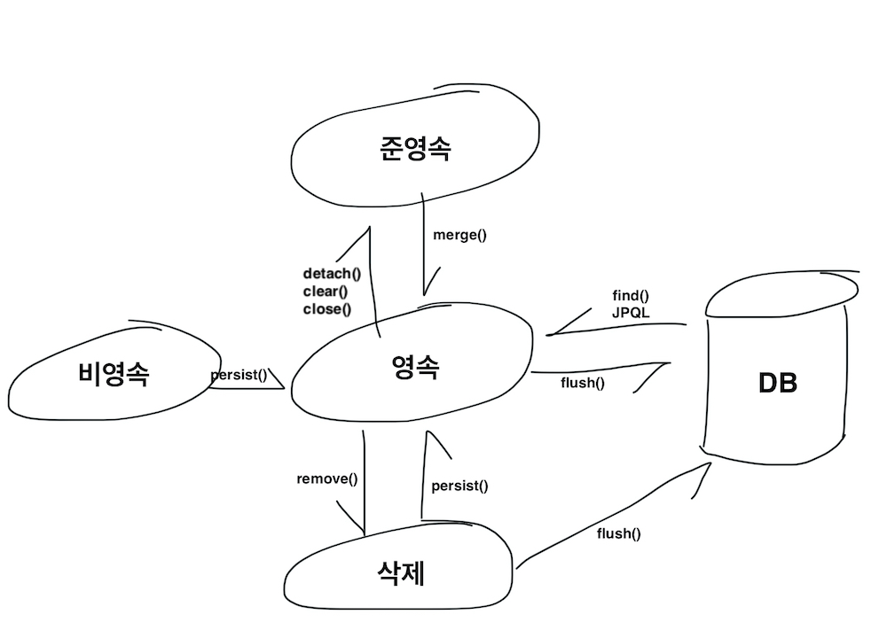
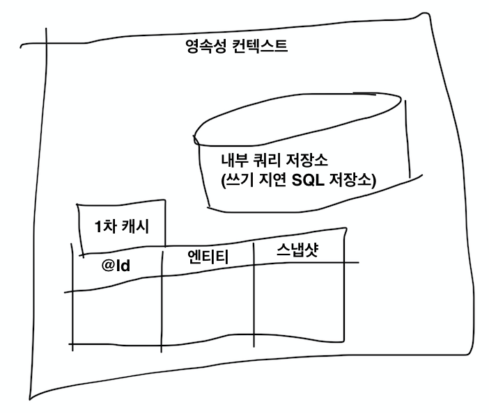

# JPA 영속성

## 엔티티 매니저(Entity Manager)
- JPA를 통해 테이블과 매핑한 엔티티는 엔티티 매니저를 통해 사용 가능
- 엔티티의 저장, 수정, 삭제, 조회 등 엔티티와 관련된 모든 일 처리
- 개발자 입장에서는 엔티티를 저장하는 가상의 데이터베이스로 생각

## 엔티티 매니저 팩토리와 엔티티 매니저
- DB를 하나만 사용하는 애플리케이션은 일반적으로 ```EntityManagerFactory```를 한 개만 생성
  - 엔티티 매니저 팩토리를 한 개 생성 후, 애플리케이션 전체에서 공유하며 필요할 때 엔티티 매니저를 생성해서 사용
  - **엔티티 매니저 팩토리는 여러 스레드가 동시 접근해도 안전하지만, 엔티티 매니저는 동시성 문제가 발생하므로 동기화 처리 필요**
- persistence.xml에 설정한 정보를 바탕으로 ```EntityManagerFactory``` 생성
- **Spring Boot**에서는 ```starter-data-jpa``` 의존성을 추가하여 엔티티 매니저 관련 자동 설정
  - 별도 옵션을 지정하고 싶다면 application.properties  또는 application.yml 파일에서 설정
- 엔티티 매니저는 데이터베이스 연결이 필요해지기 전에는 커넥션을 얻지 않으며 일반적으로 **트랜잭션 시작 시 커넥션 획득**

## 영속성 컨텍스트(Persistence context)
- 엔티티를 영구저장하는 환경
- 엔티티 매니저로 엔티티를 저장하거나 조회하면 엔티티 매니저는 영속성 컨텍스트에 접근하여 엔티티를 보관 및 관리
- 영속성 컨텍스트는 논리적인 개념이며 눈에 보이지 않는 것
- 엔티티 매니저 생성 시 한 개 생성
- [참고] 여러 엔티티 매니저가 같은 영속성 컨텍스트에 접근 가능

## 엔티티의 생명주기



- 엔티티의 4가지 상태
    1. 비영속
        - 영속성 컨텍스트와 관계가 없는 상태
    2. 영속
        - 영속성 컨텍스트에 저장된 상태
    3. 준영속
        - 영속성 컨텍스트에 저장되었다가 분리된 상태
    4. 삭제
        - 삭제된 상태
- 비영속
  - 엔티티 객체 생성 후, 순수한 객체 상태이고 아직 저장하지 않았을 때
  - 영속성 컨텍스트나 데이터베이스와 관련이 없는 상태
- 영속
  - 엔티티 매니저를 통해 엔티티가 영속성에 저장된 상태
  - 객체를 persist()하거나 DB에서 find() 했을 때
- 준영속
  - 영속성 컨텍스트가 과거에 관리하던 객체
- 삭제
  - 엔티티를 영속성 컨텍스트와 데이터베이스에서 삭제

## 영속성 컨텍스트의 특징



- 영속 상태는 식별자 값이 필수
  - 영속성 컨텍스트는 엔티티를 식별자 값(@Id)으로 구분하기 때문
  - 식별자 값이 없으면 예외 발생
- 트랜잭션을 커밋하는 순간 영속성 컨텍스트에 저장된 엔티티를 데이터베이스에 반영(flush)
- 영속성 컨텍스트가 엔티티 관리 시 얻는 장점
  - **1차 캐시**
    - 영속성 컨텍스트는 내부에 **영속 상태의 엔티티를 보관하는 캐시** 보유
    - Map이 있고, 키는 @Id로 매핑한 식별자(DB 기본 키와 매핑)이며 값은 엔티티 인스턴스
    - 영속성 컨텍스트에 데이터를 저장하고 조회하는 모든 기준은 DB 기본 키 값
    - find() 호출 시 먼저 1차 캐시에서 엔티티 찾기
    - 1차 캐시에 없으면 DB에서 조회하여 엔티티 생성하고 1차 캐시에 저장 후 영속 상태의 엔티티 반환
    - 1차 캐시 사용으로 성능 향상
  - **동일성 보장**
    - 식별자가 같은 엔티티 인스턴스를 여러 변수에 할당해도 모두 같은 객체
    ```JAVA
    Member a = em.find(Member.class, "member1");
    Member b = em.find(Member.class, "member1");
    a == b // true
    ```
  - **트랜잭션을 지원하는 쓰기 지연**
    - 엔티티 매니저는 트랜잭션 커밋 직전까지 DB에 엔티티를 저장하지 않고, 내부 쿼리 저장소에 INSERT SQL 보관
    - 트랜잭션 커밋할 때 보관해둔 쿼리를 DB로 전달
      - flush() 작업으로 영속성 컨텍스트의 변경 내용과 DB 동기화 후 커밋
    - 트랜잭션 범위 내에서 실행되는 쓰기 작업은 트랜잭션 종료 후 커밋 직전에만 SQL을 전달하면 되기 때문에 쓰기 지연이 가능
  - **변경 감지(dirty checking)**
    - JPA를 사용하면 엔티티를 조회(엔티티 영속화)해서 데이터만 변경하면 UPDATE 가능
    - 변경 감지 과정
      - JPA는 엔티티를 영속성 컨텍스트에 보관 시, 최초 상태를 복사해서 저장(스냅샷)
      - flush 시점에 스냅샷과 엔티티를 비교해 변경된 엔티티 확인
      - 변경된 엔티티가 있으면 UPDATE 쿼리를 생성해서 내부 쿼리 저장소를 거쳐 DB로 전달하고 최종으로 트랜잭션 커밋
    - **영속 상태의 엔티티에만 적용 가능**
    - [참고J 변경 감지로 만들어진 UPDATE 쿼리 분석
      - JPA는 변경 감지로 UPDATE 쿼리 생성 시 모든 필드를 수정하는 것이 기본 전략
      - 이유(장점)
        - 모든 필드 사용 시 수정 쿼리가 항상 동일하기 때문에 애플리케이션 로딩 시점에 쿼리 미리 생성해두고 재사용 가능
        - DB에 동일한 쿼리 전송 시 이전에 한 번 파싱된 쿼리 재사용 가능
      - 필요 시 수정된 데이터만 사용해서 동적으로 UPDATE 쿼리 생성하는 전략 사용
  - **지연 로딩**
    - 실제 객체 대신 프록시 객체를 로딩해두고 해당 객체를 실제로 사용할 때, 영속성 컨텍스트를 통해 데이터를 불러오는 방법

## 플러시(flush)
- **영속성 컨텍스트의 변경 내용을 데이터베이스에 반영**
- **영속성 컨텍스트와 데이터베이스 동기화**
  - 플러시로 영속성 컨텍스트에서 엔티티를 제거하는 것은 아님
- 플러시가 동작하면
  - 변경 감지가 동작해서 영속성 컨텍스트의 모든 엔티티를 스냅샷과 비교
  - 변경된 엔티티 찾아서 수정 쿼리 만들고 내부 쿼리 저장소(쓰기 지연 SQL 저장소)에 등록
  - 내부 쿼리 저장소의 쿼리를 데이터베이스에 전송(등록, 수정, 삭제)
    - 등록 쿼리는 새로운 고유값 가지는 엔티티 생성해서 persist() 호출 시 생성해 내부 쿼리 저장소로 전달
    - 삭제 쿼리는 삭제할 엔티티를 remove()에 전달하여 호출 시 생성해 내부 쿼리 저장소로 전달
- 플러시하는 방법
    1. flush() 직접 호출
        - 테스트나 다른 프레임워크와 JPA를 함께 사용할 때를 제외하고 거의 미사용
    2. 트랜잭션 커밋 시 자동 호출
    3. JPQL 쿼리 실행 시 자동 호출

## 준영속
- 영속 상태의 엔티티가 영속성 컨텍스트에서 분리된 상태
- 영속성 컨텍스트가 제공하는 모든 기능 사용 불가능
- 준영속 상태로 만드는 방법
    1. detach(entity)
        - 특정 엔티티만 준영속 상태로 전환
        - 1차 캐시부터 내부 쿼리 저장소까지 해당 엔티티의 모든 정보 제거
    2. clear()
        - 영속성 컨텍스트 초기화
        - 해당 영속성 컨텍스트의 모든 엔티티를 준영속 상태로 전환
    3. close()
        - 영속성 컨텍스트 종료
        - 해당 영속성 컨텍스트의 모든 엔티티가 준영속 상태로 전환
- 일반적으로 영속성 컨텍스트가 종료되면서 준영속 상태로 전환되어 개발자가 직접 준영속 상태로 만드는 것은 드문 일
- 특징
  - 거의 비영속 상태
    - 1차 캐시, 쓰기 지연, 변경 감지, 지연 로딩 등 모든 기능 미동작
  - 이미 한 번 영속 상태였기 때문에 식별자 값 보유

## 영속 상태가 아닌 엔티티를 영속 상태로 되돌리기
- 준영속이나 비영속 상태의 엔티티를 다시 영속 상태로 변경하려면 ```merge()``` 사용
- 준영속 병합
  - 준영속 상태의 엔티티를 받아서 새로운 영속 상태의 엔티티 반환
  ```JAVA
  static void mergeMember(Member member) { // 준영속 엔티티
    EntityManager em = emf.createEntityManager();
    EntityTransaction t = em.getTransaction();

    t.begin();
    Member mergeMember = em.merge(member);
    t.commit();
  }
  ```
  - ```merge()``` 호출 시
    - 파라미터로 넘어온 준영속 엔티티의 식별자 값으로 1차 캐시에서 엔티티 조회
      - 1차 캐시에 없으면 DB에서 조회 후 1차 캐시에 저장
    - 조회한 영속 엔티티에 기존 준영속 엔티티(member)의 모든 값을 덮어쓰기하여 반환
      - 파라미터로 넘긴 기존 준영속 엔티티는 계속 준영속 상태(엔티티 매니저를 새로 생성하여 영속성 컨텍스트도 새로 생성되었기 때문에 member와 mergeMember는 다른 새로운 엔티티 객체가 됨)
      - 기존 준영속 엔티티는 필요 없기 때문에 새로운 변수(mergeMember)를 만들기보다는 기존 변수가 새로 받은 영속 엔티티를 참조하도록 변경하는 것이 안전
        ```JAVA
        //Member mergeMember = em.merge(member); 대신
        member = em.merge(member);
        ```
- 비영속 병합
  - 1차 캐시와 데이터베이스에 없는 엔티티면 새로운 엔티티를 생성해서 병합
- 병합은 save or update 기능 수행

# Reference
- 김영한, 『자바 ORM 표준 JPA 프로그래밍』, 에이콘(2015)
- [JPA persistence 설정 및 Entity manager 설명](https://wedul.site/511)
