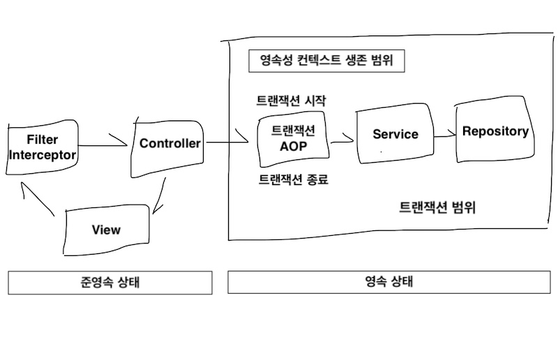
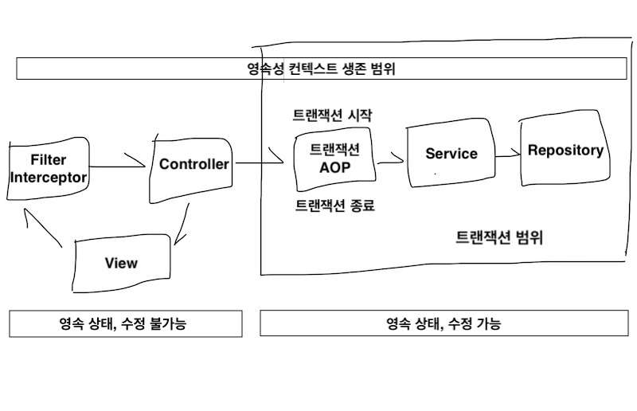

# 웹 애플리케이션과 영속성 관리
- 컨테이너 환경에서 JPA의 내부 동작 방식을 이해하고, 발생할 수 있는 문제점과 해결 방안

## 트랜잭션 범위의 영속성 컨텍스트



- 스프링 컨테이너의 기본 전략
  - 트랜잭션 범위의 영속성 컨텍스트 전략이 기본
  - 트랜잭션 시작 시 영속성 컨텍스트를 생성하고, 트랜잭션 끝날 때 영속성 컨텍스트 종료
  - 같은 트랜잭션 안에서는 항상 같은 영속성 컨텍스트에 접근
    - 엔티티 매니저가 달라도 같은 영속성 컨텍스트 사용
  - 다른 트랜잭션 간에는 다른 영속성 컨텍스트에 접근
    - 엔티티 매니저가 같아도 다른 영속성 컨텍스트 사용
    - 스프링 컨테이너는 스레드마다 각각 다른 트랜잭션을 할당하기 때문에 같은 엔티티 매니저를 호출해도 멀티스레드 상황에 안전

## 준영속 상태와 지연 로딩
```JAVA
@ManyToOne(fetch = FetchType.LAZY)
private Member member;
```
- 엔티티의 연관관계 필드를 지연 로딩으로 설정했을 때, 엔티티가 컨트롤러와 뷰 등에서 준영속 상태라면 예외 발생
  - 하이버네이트 구현체 사용 시 ```LazyInitializationException``` 발생
- 준영속 상태의 지연 로딩 문제 해결 방법
    1. 컨트롤러나 뷰가 필요로 하는 엔티티를 **미리 로딩**해두는 방법
        - 영속성 컨테이너가 살아있을 때 뷰에 필요한 엔티티를 미리 다 로딩하거나 초기화해서 반환하는 방법
            1. **글로벌 페치 전략을 즉시 로딩으로 변경**
                - ```fetch = FetchType.EAGER```
                - 글로벌 페치 전략 : 엔티티에 있는 fetch 타입 변경 시, 애플리케이션 전체에서 이 엔티티를 로딩할 떄마다 지정한 전략을 사용
                - 단점
                  - 사용하지 않는 엔티티까지 모두 로딩
                  - **N+1문제 발생**
                    - JPA를 사용하면서 성능상 가장 조심해야 하는 문제
                    - 즉시 로딩이면 JOIN 쿼리를 사용해서 한 번에 연관된 엔티티까지 조회하여 좋아보이지만, **JPQL** 사용 시 문제 발생
                    ```JAVA
                    // 연관된 모든 엔티티 조회
                    List<Order> orders = em.createQuery("select o from Order o", Order.class)
                    .getResultList();
                    ```
                    ```mysql
                    # 실행된 SQL
                    select * from Order; # JPQL로 실행된 SQL
                    select * from Member where id=? # EAGER로 실행된 SQL
                    select * from Member where id=? # EAGER로 실행된 SQL
                    select * from Member where id=? # EAGER로 실행된 SQL
                    select * from Member where id=? # EAGER로 실행된 SQL
                    . . .
                    ```
                    - **JPA가 JPQL을 분석해서 SQL을 생성할 때는 글로벌 페치 전략을 참고하지 않고, 오직 JPQL 자체만 사용**
                      - JPQL 기반 SQL로 결과를 받아온 다음, 엔티티를 생성할 때 즉시 로딩 전략임을 확인하고, 연관 엔티티 조회 쿼리를 조회한 엔티티 수만큼 실행
                    - 조회 쿼리 성능에 치명적이므로 최우선 최적화 대상
                    - **JPQL 페치 조인으로 해결 가능**
            2. **JPQL 페치 조인**
                - JPQL 호출 시점에 함께 로딩할 엔티티를 선택할 수 있는 페치 조인 방법
                - 조인 명령어 마지막에 ```fetch``` 추가
                  ```mysql
                  #사용 전
                  JPQL : select o from Order o
                  SQL :  select * from Order
                  
                  #사용 후
                  JPQL : select o from Order o join fetch o.member
                  SQL :  select o.*, m.* from Order o join Member m on o.MEMBER_ID = m.MEMBER_ID
                  ```
                  - 페치 조인을 사용해서 연관된 엔티티를 이미 로딩했기 때문에 글로벌 페치 전략이 무의미
                - 단점
                  - 무분별하게 사용 시 화면단에 의존하는 리포지토리 메소드가 증가
                - 무분별한 최적화보다 적절한 타협점을 찾는 것이 합리적
            3. **강제 초기화**
                - 영속성 컨텍스트가 살아있을 때 프리젠테이션 계층에 필요한 엔티티를 강제로 초기화하여 반환하는 방법
                - 지연 로딩 사용 시 연관된 엔티티는 실제 엔티티가 아닌 프록시 객체로 조회하는데 **프록시 객체는 실제 사용 시점에 엔티티로 초기화**
                ```JAVA
                Order order = orderRepository.findOrder(id);
                order.getMember().getName();
                ```
                  - ```getMember()``` 까지만 호출 시 프록시 객체만 반환하고 초기화되지 않은 상태
                  - ```getName()``` 까지 사용해서 실제 값을 사용한 시점에 초기화
                - 하이버네이트 사용 시 ```initialize()``` 메소드를 사용해서 프록시 강제 초기화 가능
                - 서비스 계층에서 프록시를 초기화하는 것은 뷰가 필요로하는 엔티티에 따라 서비스 계층의 변경이 발생하여 의존적이게 됨
                - 분리하기 위해 **FACADE 계층 추가**
                  - Controller와 Service 사이에 FACADE 계층 추가
                  - FACADE에서 트랜잭션을 시작해야 영속성 컨텍스트 내에서 프록시 초기화 가능
                  - 프리젠테이션 계층과 도메인 모델 간 논리적 의존성 분리
                  - 프리젠테이션 계층에서 꼭 필요한 프록시 객체 초기화
                  - 서비스 계층을 호출해서 비즈니스 로직 실행
                  - 리포지토리를 직접 호출해서 뷰가 요구하는 엔티티 조회
                  - 단점
                    - 중간에 계층이 하나 더 끼어드는 점
                    - 단순히 서비스 계층을 호출만 하는 위임 코드 양 증가
        - 이 방법은 생각보다 오류 발생 가능성이 높고, 번거로운 과정
        - 모든 문제는 엔티티가 프리젠테이션 계층에서 준영속 상태이기 때문에 발생

    2. **OSIV**를 사용해서 엔티티를 항상 영속 상태로 유지하는 방법
        - **영속성 컨텍스트를 뷰까지 열어두는 것**
        - **과거 OSIV**
          - 요청 당 트랜잭션 방식의 OSIV
            - 클라이언트 요청이 들어오자마자 서블릿 필터나 스프링 인터셉터에서 트랜잭션을 시작하고, 요청이 끝날 때 트랜잭션을 끝내는 것
          - 문제점
            - 프리젠테이션 계층이 엔티티를 변경 가능
            - 데이터베이스 내용이 변경되기 때문에 유지보수가 힘들어짐
          - 해결 방법
            - 엔티티를 읽기 전용 인터페이스로 제공
            - 읽기 전용 메소드만 갖고 있는 래핑 엔티티 객체
            - DTO만 반환
            - 단, 코드량이 상당히 증가하는 단점
        - **스프링 OSIV**

          

          - 비즈니스 계층에서만 트랜잭션을 유지하는 방식
          - spirng-orm.jar가 제공
            - 하이버네이트 OSIV 서블릿 필터
            - 하이버네이트 OSIV 스프링 인터셉터
            - JPA OEIV 서블릿 필터
            - JPA OEIV 스프링 인터셉터
          - 동작 원리
              1. 클라이언트 요청 시 필터나 인터셉터에서 영속성 컨텍스트 생성(트랜잭션 시작 전)
              2. 서비스 계층에서 @Transactional로 트랜잭션 시작할 때, 미리 생성해둔 영속성 컨텍스트를 찾아와서 트랜잭션 시작
              3. **서비스 계층 끝나면 트랜잭션 커밋하고 영속성 컨텍스트 플러시**(영속성 컨텍스트는 유지)
              4. 컨트롤러와 뷰까지 조회한 엔티티는 영속상태 유지
              5. 필터나 인터셉터로 돌아오면 영속성 컨텍스트는 **플러시를 호출하지 않고 바로 종료**
          - 영속성 컨텍스트를 통한 모든 변경은 트랜잭션 안에서만 가능하며, 외부에서 강제로 ```em.flush()```를 호출해서 변경 시도하면 ```TransactionRequiredException``` 예외 발생
          - **요약**
             - 영속성 컨텍스트를 프리젠테이션 계층까지 유지
             - 프리젠테이션 계층에는 트랜잭션이 없으므로 엔티티의 실제 데이터 수정 불가
             - 프리젠테이션 계층에는 트랜잭션 없이 읽기가 가능하므로 지연 로딩 가능
          - **주의사항**
            - 프리젠테이션 계층에서 엔티티 객체의 값을 수정한 직후에 트랜잭션 시작하는 서비스 계층 호출 시 문제 발생
              - 트랜잭션 걸린 메소드가 종료할 때 변경 감지가 동작해서 실제 데이터가 수정
            - **컨트롤러에서는 트랜잭션이 있는 모든 비즈니스 로직 호출 후 마지막에 엔티티를 변경 필요**

### OSIV 정리
- 스프링 OSIV 특징
  - 클라이언트 요청이 들어올 때 영속성 컨텍스트를 생성해서 요청 끝날 때까지 같은 영속성 컨텍스트를 유지
  - 한 번 조회한 엔티티는 요청이 끝날 때까지 영속 상태 유지
  - 엔티티 수정은 트랜잭션이 있는 계층에서만 동작
  - 트랜잭션이 없는 계층은 지연 로딩을 포함해서 조회만 가능

- 스프링 OSIV 단점
  - 같은 영속성 컨텍스트를 여러 트랜잭션이 공유 가능
    - 트랜잭션 롤백 시 주의 필요
  - 프리젠테이션 계층에서 엔티티 수정 후 비즈니스 로직 수행 시 엔티티 수정 가능성
  - 프리젠테이션 계층에서 지연 로딩에 의한 SQL 실행
    - 성능 튜닝 시 확인 범위 증가

- OSIV vs FACADE vs DTO
  - OSIV를 사용하지 않는 대안으로 FACADE와 DTO가 있지만 둘 다 OSIV에 비해 지루한 코드를 많이 작성해야 하는 단점
  - 단 상황에 따라 OSIV가 만능은 아님
    - 복잡한 통계 화면 구성 시 처음부터 JPQL을 작성해서 DTO로 조회하는 것이 효과적
    - 수많은 테이블을 조인해서 보여주는 복잡한 관리자 화면도 마찬가지

- OSIV는 같은 JVM을 벗어난 원격 상황에서는 불가능
  - JSON이나 XML 생성 시에는 지연 로딩이 가능하지만 클라이언트가 연관 엔티티를 지연 로딩하는 것은 불가능
  - 따라서 클라이언트가 필요로 하는 데이터를 모두 JSON으로 생성해서 반환 필요
    - 외부 API는 DTO를 사용해서 노출하고, 내부 API는 엔티티를 직접 노출해도 무방
      - 외부 API
        - 타 팀이나 타 기업과 협업하는 API
        - 한 번 정의하면 변경이 어려움
      - 내부 API
        - 같은 프로젝트에 있는 화면 구성을 위한 AJAX 호출
        - 언제든지 변경 가능

### Reference
- 김영한, 『자바 ORM 표준 JPA 프로그래밍』, 에이콘(2015)
