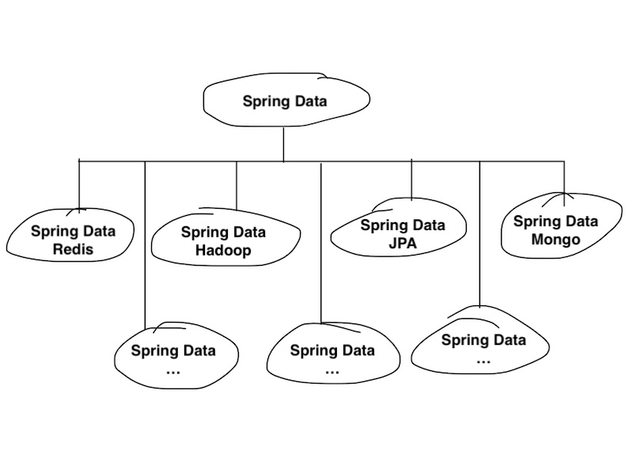
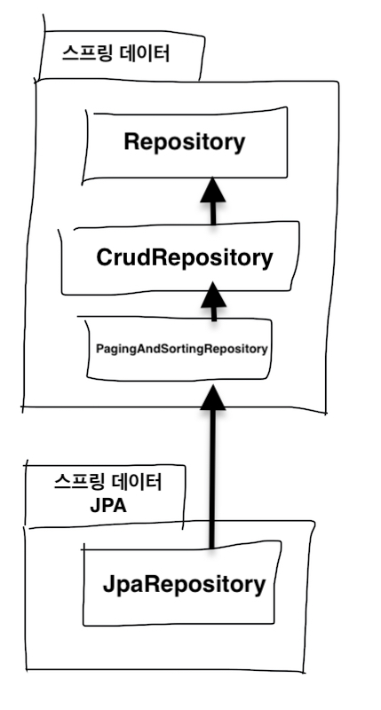

# 스프링 데이터 JPA
- 데이터 접근 계층은 보통 반복적인 CRUD 작업을 수행
- 공통 부분을 처리하는 부모 클래스를 만들어 상속하는 것에도 한계
- 위 문제는 JPA도 마찬가지이지만 스프링 데이터 JPA로 해결 가능
- 스프링 프레임워크에서 JPA를 편리하게 사용할 수 있도록 지원
- CRUD 처리하는 공통 인터페이스 제공
- **리포지토리 개발 시 인터페이스만 작성하면 실행 시점에 스프링 데이터 JPA가 구현 객체 동적 생성하여 주입**
  - ```JpaRepository```를 상속 받는 인터페이스 작성
- 공통으로 처리할 수 없는 메소드는 스프링 데이터 JPA가 메소드 이름을 분석해서 JPQL을 실행
  - ```MemberRepository.findByUsername()``` -> ```select m from Member m where username = :username```

## 스프링 데이터 프로젝트



- 다양한 데이터 저장소에 대한 접근을 추상화
- 스프링 데이터 JPA는 스프링 데이터의 하위 프로젝트이며 JPA에 특화된 기능 제공

## 스프링 데이터 JPA 설정
- spring-data-jpa 라이브러리 의존성 추가 후 XML과 JavaConfig 설정
- 스프링 부트 사용 시 build.gradle에 ```spring-boot-starter-data-jpa```만 추가

## 공통 인터페이스 기능
- ```JpaRepository```를 상속 받고 제네릭에 엔티티 클래스와 엔티티의 식별자 타입 지정
  - ```MemberRepository extends JpaRepository<Member, Long>```
- 인터페이스 계층구조

  

  - 주요 메소드
    - S : 엔티티와 자식 타입 / T : 엔티티 / ID : 엔티티의 식별자 타입
    - save(S) : 새로운 엔티티 저장, 이미 있는 엔티티 수정
    - delete(T) : 엔티티 삭제
    - findOne(ID) : 엔티티를 프록시로 조회
    - findAll() : 모든 엔티티 조회, 정렬이나 페이징 조건을 파라미터로 제공 가능

## 쿼리 메소드 기능
- 작성 방법
  - 메소드 이름으로 쿼리 생성
    - 스프링 JPA는 정해진 규칙에 따라 정의된 메소드명을 분석해서 JPQL 생성 및 실행
    - 규칙은 [링크](https://docs.spring.io/spring-data/jpa/docs/2.4.0/reference/html/#jpa.query-methods.query-creation) 참조

  - 메소드 이름으로 JPA NamedQuery 호출
    - 쿼리에 이름을 부여해서 사용하는 방법
    - 어노테이션이나 XML 파일에 쿼리 정의 가능
      ```JAVA
      @Entity
      @NamedQuery(
        name = "Member.findByUsername",
        query = "select m from Member m where m.username = :username")
      public class Member { . . . }
      ```
      ```XML
      <named-query name="Member.findByUsername">
        <query>
          <CDATA[
            select m
            from Member m
            where m.username = :username
            ]>
        </query>
      </named-query>
      ```
    - 리포지토리 인터페이스에 정의한 쿼리의 메소드 이름 작성
    - '도메인 클래스 + . + 메소드 이름'으로 Named 쿼리 찾아서 실행
      ```JAVA
      public interface MemberRepository extends JpaRepository<Member, Long> {
        List<Membe> findByUsername(@Param("username") String username);
      }
      ```
      - @Param 사용해서 이름 기반 파라미터 바인딩
    - 애플리케이션 실행 시점에 문법 오류 발견 가능

  - @Query 사용해서 리포지토리 인터페이스에 쿼리 직접 정의
    - 리포지토리 메소드에 직접 쿼리 정의
    - 이름 없는 NamedQuery
    - 애플리케이션 실행 시점에 문법 오류 발견 가능
    - 네이티브 쿼리를 사용하려면 어노테이션에 ```nativeQuery = true``` 옵션 추가

### 파라미터 바인딩
- 스프링 데이터 JPA는 위치 기반 파라미터 바인딩, 이름 기반 파라미터 바인딩 지원
- 기본 값은 위치 기반
- 위치 기반 : ```select m from Member m where m.username = ?1```
- 이름 기반 : ```select m from Member m where m.username = :name```
- 코드 가도성과 유지보수를 위해 이름 기반 지향

### 벌크성 수정 쿼리
- 벌크성 수정 : 대량의 데이터를 쿼리를 통해 수정하는 것
- @Modifying 사용
- 옵션으로 ```clearAuthmatically = true``` 사용 시 영속성 컨텍스트 초기화(기본값은 false)

### 반환 타입
- 다양한 반환 타입 지원
- 조회 결과 유 : 결과가 다수면 컬렉션 인터페이스 사용, 한 건이면 반환 타입 지정
- 조회 결과 무 : 빈 컬렉션 반환, 한 건이면 null 반환
- 반환 타입이 지정된 메소드의 반환값이 다수면 ```javax.persistence.NonUniqueResultException``` 발생

### 페이징과 정렬
- 페이징을 위한 파라미터 제공
  - ```Sort```로 정렬
  - ```Pageable```로 페이징(```Sort``` 포함)
- 페이징 파라미터 사용 시 반환 타입으로 ```List```, ```Page``` 사용
  - ```Page``` 사용 시 전체 데이터 건 수 조회하는 count 쿼리 추가 호출
    ```JAVA
    Page<Member> findByName(String name, Pageable pageable);
    List<Member> findByName(String name, Pageable pageable);
    List<Member> findByName(String name, Sort sort);
    ```
  - ```Pageable``` 인터페이스의 구현체는 ```PageRequest```
    - ```new PageRequest(0, 10, new Sort(Direction.DESC, "name"));```
    - 인자 순서는 현재 페이지, 한 페이지에 조회할 데이터 수, 정렬 정보
    
### 힌트
- @QueryHints 사용하여 JPA 구현체에게 힌트 제공 가능

### 락
- @Lock 사용하여 쿼리 시 락 걸기 가능

## 명세
- ???

## 사용자 정의 리포지토리
- 스프링 데이터 JPA 사용 시 주로 인터페이스만 정의하지만 때에 따라 메소드 직접 구현이 필요한 경우 필요한 메소드만 구현해서 사용 가능
- 사용자 정의 인터페이스 생성하고 사용자 정의 구현 클래스에서 상속받아 구현
  - 구현 클래스 명명 규칙은 '리포지토리 인터페이스 이름 + Impl'

## 웹 확장
- 설정 방법
  - 스프링 MVC 사용 시 ```SpringDataWebConfiguration```을 빈으로 등록
    - JavaConfig 사용시 @EnableSpringDataWebSupport 추가
  - 스프링 부트 사용 시 ```spring-boot-starter-web``` 의존성 추가 시 기능 제공
- 도메인 클래스 컨버터 기능
  - HTTP 파라미터로 넘어온 엔티티의 아이디로 엔티티 객체를 찾아서 바인딩
  ```JAVA
  @Controller
  public class MemberController {
    @RequestMapping("member/memberUpdateForm")
    public String memberUpdateForm(@RequestParam("id") Member member, Model model) {
      model.addAttribute("member", member);
      return "member/memberSaveForm";
    }
  }
  ```
    - ```@RequestParam("id") Member member``` 부분 확인
      - 요청 받은 id를 사용하여 도메인 클래스 컨버터가 동작해서 id를 회원 엔티티 객체로 변환해서 넘김
  - **해당 엔티티와 관련된 리포지토리를 사용해서 엔티티 조회**
    - 단, 영속성 컨텍스트에 올라와있지 않기 때문에 수정해도 DB 미반영

## 스프링 데이터 JPA가 사용하는 구현체
- 공통 인터페이스는 ```SimpleJpaRepository```
- ```SimpleJpaRepository``` 특징
  - @Repository 사용
    - JPA 예외를 스프링이 추상화한 예외로 변환
  - @Transactional 사용
    - JPA의 모든 변경은 트랜잭션 안에서 동작
    - 데이터를 변경(등록, 수정, 삭제)하는 메소드에 @Transactional가 있기 때문에 서비스 계층에서 시작하지 않으면 리포지토리에서 트랜잭션 시작
    - 데이터를 조회하는 메소드에는 ```readOnly = true``` 옵션 사용하여 약간의 성능 향상

## 스프링 데이터 JPA와 QueryDSL
- QueryDSL을 지원하는 방법
    1. QueryDslPredicateExecutor 사용
        - ```org.springframework.data.querydsl.QueryDslPredicateExecutor```
        - 리포지토리에서 ```QueryDslPredicateExecutor``` 상속
        - QueryDSL을 검색 조건으로 사용하면서 스프링 데이터 JPA의 페이징과 정렬 기능 함께 사용 가능
        - 한계 : join, fetch 사용 불가
    2. QueryDslRepositorySupport 사용
        - ```org.springframework.data.querydsl.QueryDslRepositorySupport```
        - 리포지토리에서 ```QueryDslRepositorySupport``` 상속
        - 사용자 정의 리포지토리 만들어서 사용
        - Executor의 한계점 해결 가능


# Reference
- 김영한, 『자바 ORM 표준 JPA 프로그래밍』, 에이콘(2015)
