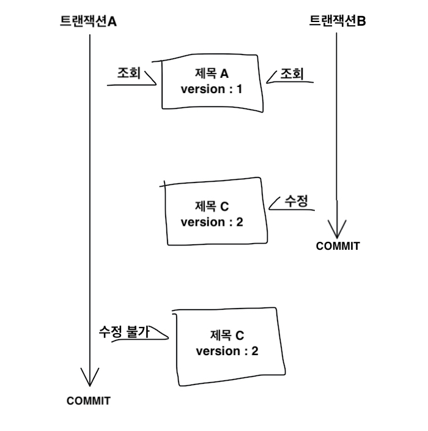
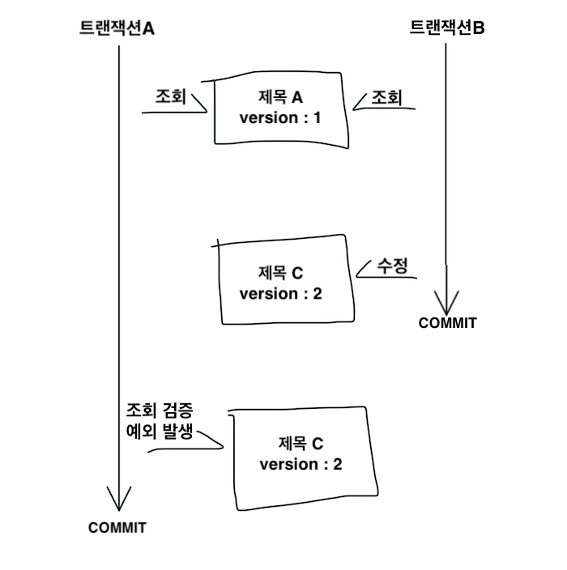
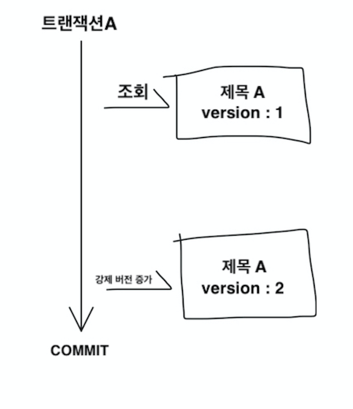
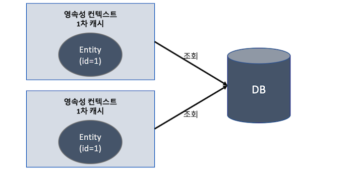
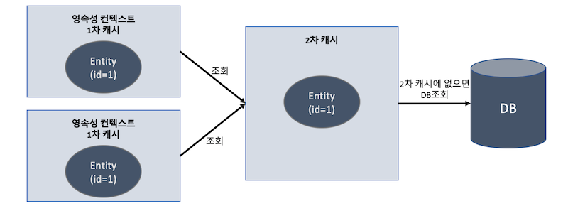

## 트랜잭션과 락, 2차 캐시

### 트랜잭션과 락
트랜잭션은 ACID라 불리는 원자성(Atomicity), 일관성(Consistency), 격리성(Isolation), 지속성(Durability)을 보장
- **원자성** : 한 트랜잭션은 한 작업단위로 취급하여 실행 중 중단은 불가능하고 롤백이나 커밋만 가능한 특성
- **일관성** : 트랜잭션 수행 전, 후로 데이터베이스 무결성과 같은 상태는 일관되어야 하는 특성
- **격리성** : 한 트랜잭션 수행 중 다른 트랜잭션이 끼어들 수 없는 특성
- **지속성** : 정상적으로 완료된 트랜잭션 결과는 영원히 디비에 반영되어있어야 하는 특성

트랜잭션은 멀티스레드 또는 동시접근 상황에서 원자성, 일관성, 지속성은 자연스럽게 보장하지만, 격리성을 보장하기 위해서는 추가 작업 필요<br />
격리성을 완전히 보장하려면 트랜잭션을 순차적으로 진행해야 하는데 이럴 경우, 동시성 처리 성능 매우 감소

따라서, 트랜잭션 격리 수준을 4단계로 나누어 정의(격리 수준 오름차순)
- READ UNCOMMITED(커밋되지 않은 읽기)
- READ COMMITED(커밋된 읽기)
- REPEATABLE READ(반복 가능한 읽기)
- SERIALIZABLE(직렬화 가능)

격리 수준이 낮을수록 동시성 성능은 높지만 데이터 정합성이 떨어지고, 수준이 높을수록 데이터 정합성이 보장되지만 동시성 성능 감소
- A, B 트랜잭션이 있다고 가정
- **DIRTY READ**
  - A가 수정하고 아직 커밋하지 않은 데이터를 B가 조회
  - B가 커밋되지 않은 데이터를 사용 중인데 A가 롤백한다면 데이터 정합성 문제 발생
  - **READ UNCOMMITED**는 DIRTY READ 허용
- **NON-REPEATABLE READ**
  - A가 '회원1'을 조회한 후 B가 '회원1'의 정보를 수정하고 커밋
  - A가 '회원1'을 다시 조회했을 때 이전과 데이터가 달라지는 문제 발생
  - 반복해서 같은 데이터를 조회할 수 없는 상태
  - **READ UNCOMMITED**, **READ COMMITED**는 NON-REPEATABLE READ 허용
- **PHANTOM READ**
  - A가 특정 조건의 데이터 목록을 조회한 후 B가 A가 조회한 조건에 부합하는 데이터 추가 삽입 후 커밋
  - A가 동일한 조회 쿼리를 다시 실행했을 때 이전에 없던 새로운 데이터가 추가되었음을 확인
  - 반복 조회 시 결과 집합이 달라지는 상태
  - **READ UNCOMMITED**, **READ COMMITED**, **REPEATABLE READ**는 PHANTOM READ 허용

  애플리케이션의 동시성 처리는 중요하므로 데이터베이스는 보통 기본 격리 수준을 READ COMMITED로 지정<br />
  일부 중요한 비즈니스 로직에 더 높은 격리 수준이 필요하면 데이터베이스가 제공하는 잠금(Lock) 기능 사용

### 낙관전 락, 비관적 락
JPA는 데이터베이스 트랜잭션 격리 수준을 READ COMMITED 정도로 가정하여 동작<br />
또한, 영속성 컨텍스트(1차 캐시)를 잘 활용한다면 격리 수준을 높이지 않고도 REPEATABLE READ 가능
더 높은 격리 수준이 필요한 로직에 락을 사용

#### 낙관적 락
트랜잭션 대부분은 충돌이 발생하지 않는다고 낙관적으로 가정하는 방법<br />
데이터베이스의 락 기능이 아닌, **JPA가 제공하는 버전 관리 기능 사용**(애플리케이션이 제공하는 락)<br />
낙관적 락은 트랜잭션 커밋 전까지 트랜잭션의 충돌 확인 불가능

#### 비관적 락
트랜잭션 충돌이 발생한다고 가정하고 우선 락을 걸고 보는 방법<br />
데이터베이스가 제공하는 락 기능 사용(ex. ```select for update```구문)

#### [참고] 두 번의 갱신 분실 문제
트랜잭션 A와 B가 거의 동시에 같은 게시물을 수정했을 때, 나중에 완료한 트랜잭션의 수정사항만 기록되는 문제<br/>
이 문제는 트랜잭션의 범위를 넘어서기 때문에 트랜잭션 만으로 문제 해결 불가능

해결 방법
- 마지막 커밋만 인정 : 마지막 이전 커밋 모두 무시 (기본값)
- 최초 커밋만 인정 : 첫번째 이후 트랜잭션이 완료 요청 시 오류 발생
- 충돌하는 갱신 내용 병합

### @Version, 최초 커밋만 인정하는 방법
JPA가 제공하는 낙관적 락을 사용하려면 ```@Version``` 어노테이션을 사용해 버전 관리 기능을 추가<br />

엔티티에 버전 관리 추가
```JAVA
@Entity
public class Board {

  @Id
  private String id;
  private String title;

  @Version
  private Integer version;
}
```
- 버전 관리용 필드 추가 후 어노테이션 지정

.```@Version``` 적용 가능 타입
- Long / long
- Integer / int
- Short / short
- Timestamp

**엔티티를 수정할 때마다 버전이 하나씩 자동으로 증가**<br />
엔티티를 수정할 때 조회 시점 버전과 수정 시점 버전이 다르면 예외 발생



#### 버전 정보 비교 방법
JPA가 버전 정보를 비교하는 방법은 엔티티 수정 후 영속성 컨텍스트를 종료하면 UPDATE 쿼리를 실행할 때 다음 방법으로 버전 확인
```SQL
UPDATE  BOARD
SET     TITLE = ?,
        VERSION = ? # 버전 + 1
WHERE   ID = ?
AND     VERSION = ? # 버전 비교
```
- 데이터베이스 버전과 엔티티 버전이 같으면 데이터 수정과 동시에 버전 증가
- 데이터베이스 버전과 엔티티 버전이 다르면 조회 결과가 없으므로 UPDATE 처리가 되지 않고, JPA가 예외 발생

버전 관리 필드는 JPA가 직접 관리하므로 개발자는 임의 수정하지 않도록 주의(벌크 연산 제외)하고, 버전 값 강제 증가가 필요하다면 다음의 락 옵션 선택

### JPA 락
JPA 사용 시 추천 전략은 **READ COMMITED 격리 수준 + 낙관적 버전 관리** 전략

락 옵션 목록. ```javax.persistence.LockModeType```에 정의

|락 모드|타입|설명|
|---|---|---|
|낙관적 락|OPTIMISTIC|낙관적 락 사용|
|낙관적 락|OPTIMISTIC_FORCE_INCREMENT|낙관적 락 + 버전 정보|
|비관적 락|PESSIMISTIC_READ|비관적 락, 읽기 락|
|비관적 락|PESSIMISTIC_WRITE|비관적 락, 쓰기 락|
|비관적 락|PESSIMISTIC_FORCE_INCREMENT|비관적 락 + 버전 정보|
|기타|NONE|락 미사용|


락 적용 가능 위치
- ```EntityManager.lock()```, ```EntityManager.find()```, ```EntityMamager.refresh()```에 매개값으로 전달
- ```Query.setLockMode()```에 매개값으로 전달
- ```@NamedQuery```

### JPA 낙관적 락
JPA가 제공하는 기능. 락 옵션 없이 ```@Version```만 있어도 낙관적 락이 적용되며 옵션 사용으로 더 세밀한 제어 가능

특징
- 버전 사용하므로 버전 필요
- 트랜잭션 커밋 시점에 충돌 확인 가능

낙관적 락에서 발생하는 예외
- ```javax.persistence.OptimisticLockException``` (JPA 예외)
- ```org.hibernate.StaleObjectStateException``` (Hibernate 예외)
- ```org.springframework.orm.ObjectOptimisticLockingFailureException``` (스프링 예외 추상화)

#### NONE
락 옵션 지정 안해도 엔티티에 ```@Version``` 적용 필드 있으면 낙관적 락 적용
- 용도 : 조회한 엔티티 수정 시 다른 트랜잭션에 의한 변경 제한. 조회 시점부터 수정 시점까지 보장
- 동작 : 엔티티 수정 시 버전 체크하면서 버전 증가 처리
- 이점 : 두 번의 갱신 분실 문제 예방

#### OPTIMISTIC
엔티티를 조회만 해도 버전 체크. 한 번 조회한 엔티티는 트랜잭션 종료 시까지 다른 트랜잭션에서 변경하지 않음을 보장<br />
다른 트랜잭션의 변경을 제한하는 것이 아니라 조회만 하는 현재 트랜잭션 종료 시 변경이 감지되면 예외 발생
- 용도 : 조회한 엔티티는 트랜잭션 끝날 때까지 다른 트랜잭션에 의해 변경되지 않음을 보장.
- 동작 : 트랜잭션 커밋할 때 버전 정보를 조회(SELECT 쿼리)해서 현재 엔티티의 버전과 같은지 검증. 다르면 예외 발생.
- 이점 : DIRTY READ와 NON-REPEATABLE READ 방지



#### OPTIMISTIC_FORCE_INCREMENT
낙관적 락을 사용하면서 버전 정보를 강제로 증가
- 용도 : 논리적인 단위의 엔티티 묶음을 관리
  - 예를 들어, 1:다 양방향 관계인 게시물:첨부파일이 있을 때 게시물 수정 시 첨부파일을 변경하면 게시물 버전은 그대로 유지
  - 해당 게시물은 물리적으로는 변경되지 않았지만 논리적으로는 변경된 것
  - 이 때 게시물의 버전을 강제로 증가하기 위해 사용
- 동작 : 엔티티를 수정하지 않아도 트랜잭션 커밋할 때 UPDATE 쿼리로 버전 정보 강제 증가. 데이터베이스 버전이 엔티티 버전과 다르면 예외 발생. 또한, 엔티티 수정하면 수정 버전이 UPDATE되어 총 2번의 버전 증가 발생 가능
- 이점 : 강제 버전 증가를 통해 논리적 단위의 엔티티 묶음 버전 관리 가능



### JPA 비관적 락
데이터베이스 트랜잭션 락 매커니즘에 의존하는 방법<br />
주로 SQL 쿼리에 ```select for update``` 구문을 사용하며 시작하고 버전 정보는 미사용<br />
비관적 락은 주로 PESSIMISTIC_WRITE 모드 사용

특징
- 엔티티가 아닌 스칼라 타입 조회 시에도 사용 가능
- 데이터 수정 즉시 트랜잭션 충돌 감지

비관적 락에서 발생하는 예외
- ```javax.persistence.PessimisticLockException``` (JPA 예외)
- ```org.springframework.dao.PessimisticLockingFailureException``` (스프링 예외 추상화)

#### PESSIMISTIC_WRITE
비관적 락의 기본 옵션. 데이터베이스에 쓰기 락 걸 때 사용
- 용도 : 데이터베이스에 쓰기 락
- 동작 : 데이터베이스 ```select for update```로 락
- 이점 : NON-REPEATABLE READ 방지. 락 걸린 row는 다른 트랜잭션이 수정 불가능

#### PESSIMISTIC_READ
데이터를 반복 읽기만 하고 수정하지 않는 용도로 락을 걸 때 사용. 잘 사용하지 않는 옵션. 데이터베이스 대부분은 PESSIMISTIC_WRITE로 동작
- MySQL : ```lock in share mode```
- PostgreSQL : ```for share```

#### PESSIMISTIC_FORCE_INCREMENT
비관적 락에서 유일하게 버전 정보를 사용하는 옵션. 하이버네이트는 ```nowait```을 지원하는 데이터베이스에 한해 ```for update nowait``` 옵션 적용
- 오라클 : ```for update nowait```
- PostgreSQL : ```for update nowait```
- ```nowait``` 미지원 데이터베이스는 ```for update``` 사용

비관적 락 사용 시, 락을 획득할 때까지 트랜잭션 대기 상태 유지<br />
무한정 기다리지 않도록 타임아웃 설정 가능
```properties
javax.persistence.lock.timeout=10000
```
- 단, 데이터베이스마다 동작 여부 차이

### 2차 캐시
네트워크를 통해 디비에 접근하는 비용은 매우 크기 때문에 조회한 데이터를 메모리에 캐시해 디비 접근 횟수를 줄임으로써 성능 개선<br />
영속성 컨텍스트 내부의 엔티티 보관 장소인 1차 캐시를 사용하여 어느정도 해결 가능하지만 일반적인 웹 애플리케이션 환경에서는 트랜잭션에 의존적이게 되는 문제

따라서, 하이버네이트를 포함한 대부분의 JPA 구현체가 제공해주는 2차 캐시까지 활용(애플리케이션 범위의 캐시)

- 1차 캐시 구조 및 특징 (2차 캐시 미적용)



  - 영속성 컨텍스트 내부에 존재
  - 엔티티 매니저로 조회하거나 변경하는 모든 엔티티 저장
  - 트랜잭션 커밋 또는 flush() 호출 시, 1차 캐시에 있는 엔티티의 변경 내용을 데이터베이스에 동기화
  - on/off 옵션이 없으며 영속성 컨텍스트가 사실상 1차 캐시
  - 1차 캐시는 같은 엔티티가 있으면 해당 엔티티를 그대로 반환하기 때문에 객체 동일성이 보장(a == b)
  - 1차 캐시는 영속성 컨텍스트 범위의 캐시
    - 컨테이너 환경에서는 트랜잭션 범위의 캐시
    -  OSIV 적용 시 요청 범위의 캐시

- 2차 캐시 구조 및 특징



  - JPA에서는 2차 캐시를 공유 캐시로 지칭 (애플리케이션에서 공유하는 캐시)
  - 애플리케이션을 종료할 때까지 캐시 유지
    - 분산 캐시 또는 클러스터링 환경 캐시는 더 오래 유지 가능
  - 2차 캐시 적용 시, 엔티티 매니저를 통해 데이터를 조회하면 우선 2차 캐시에서 찾고 없으면 데이터베이스에서 조회한 다음 2차 캐시에 저장해두고 엔티티를 복사해서 반환
  - 동시성을 극대화하기 위해 캐시한 객체를 직접 반환하지 않고 **복사본을 반환**
    - 동시 접근 제한을 위해 락을 거는 것보다 훨씬 저렴한 비용
  - 영속성 유닛 범위의 캐시
  - 데이터베이스 키를 기준으로 캐시하지만, 영속성 컨텍스트가 다르면 객체 동일성 미보장

** 궁금
부트에서 설정 어떻게 해주는지?

### JPA 2차 캐시 표준화 기능
JPA 캐시 표준은 여러 구현체가 공통으로 사용하는 부분만 표준화했기 때문에 상세한 설정을 하려면 구현체에 의존적인 기능 사용 필요

#### 캐시 모드 설정
2차 캐시를 사용하려면 엔티티에 ```javax.persistence.Cacheable``` 어노테이션 사용
```JAVA
@Cacheable
@Entity
public class Member {
  @Id
  @GeneratedValue
  private Long id;
  . . .
}
```
  - 연관관계 있을 경우 양쪽 엔티티 둘 다 ```@Cacheable``` 사용

애플리케이션 전체(영속성 유닛 단위)에 캐시를 어떻게 적용할지 옵션 설정 추가
- 스프링 프레임워크에서 XML에 설정
  ```XML
  <bean id="entityManagerFactory" class="org.springframework.orm.jpa.LocalContainerEntityManagerFactoryBean">
    <property name="sharedCacheMode" value="ENABLE_SELECTIVE" />
    . . .
  </bean>
  ```
- 스프링 부트에서 property 또는 yaml 파일에 설정
  ```properties
  spring.jpa.properties.javax.persistence.sharedCache.mode=ENABLE_SELECTIVE
  ```
옵션 목록

|캐시 모드|설명|
|---|---|
|ALL|모든 엔티티를 캐시|
|NONE|캐시 미사용|
|**ENABLE_SELECTIVE**|Cacheable 설정된 엔티티만 캐시 적용|
|DISABLE_SELECTIVE|모든 엔티티를 캐시하되 Cacheable 설정된 엔티티는 캐시 미사용|
|UNSPECIFIED|JPA 구현체가 정의한 설정 따름|

#### 캐시 조회, 저장 방식 설정
캐시를 무시하고 데이터베이스를 직접 조회하거나 캐시를 갱신하려면 '캐시 조회 모드'와 '캐시 보관 모드' 사용

설정 방법
- ```EntityManager.setProperty("javax.persistence.cache.retrieveMode", CacheRetrieveMode.BYPASS);```

캐시 조회 모드의 프로퍼티 및 옵션
- 프로퍼티 : ```javax.persistence.cache.retrieveMode```
- 옵션 : ```javax.persistence.CacheRetrieveMode```
  - ```USE``` : 캐시에서 조회(기본값)
  - ```BYPASS``` : 캐시 무시하고 데이터베이스 직접 접근해서 조회

캐시 보관 모드의 프로퍼티 및 옵션
- 프로퍼티 : ```javax.persistence.cache.storeMode```
- 옵션 : ```javax.persistence.CacheStoreMode```
  - ```USE``` : 조회 데이터를 캐시에 저장. 이미 있으면 무시(갱신x). 트랜잭션 커밋 후 등록/수정한 엔티티를 캐시에 저장(기본값)
  - ```BYPASS``` : 캐시 저장 X
  - ```REFRESH``` : ```USE``` 전략에서 조회 엔티티를 최신 상태로 갱신 캐시

#### JPA 캐시 관리 API
JPA는 캐시 관리를 위한 ```javax.persistence.Cache``` 인터페이스 제공
- ```EntityManagerFactory.getCache()```로 캐시 가져오기 가능

Cache 인터페이스
```JAVA
public interface Cache {

  // 해당 엔티티가 캐시에 있는지 여부 확인
  public boolean contains(Class cls, Object primaryKey);

  // 해당 엔티티 중 특정 식별자를 가진 엔티티를 캐시에서 제거
  public void evict(Class cls, Object primaryKey);

  // 해당 엔티티 전체를 캐시에서 제거
  public void evict(Class cls);

  // 모든 캐시 데이터 제거
  public void evictAll();

  // JPA Cache 구현체 조회
  public <T> T unwrap(Class<T> cls);
}
```

### 하이버네이트와 EHCACHE 적용
JPA가 표준화한 캐시 기능을 토대로 구현체인 하이버네이트를 이용해 실제 2차 캐시 적용

하이버네이트 지원 캐시
- **엔티티 캐시** : 엔티티 단위 캐시. 식별자로 엔티티 조회 및 컬렉션 타입 제외한 연관 엔티티 로딩 시 사용 (JPA 표준)
- **컬렉션 캐시** : 엔티티와 연관된 컬렉션 캐시. **컬렉션이 엔티티를 담고 있으면 식별자 값만 캐시** (하이버네이트 기능)
- **쿼리 캐시** : 쿼리와 파라미터 정보를 키로 사용해서 캐시. **결과가 엔티티면 식별자 값만 캐시** (하이버네이트 기능)

#### 환경설정
#### 1. 의존성 추가
메이븐
```xml
<dependency>
    <groupId>org.hibernate</groupId>
    <artifactId>hibernate-ehcache</artifactId>
    <version>5.4.21.Final</version>
</dependency>
```
그래들
```gradle
compile group: 'org.hibernate', name: 'hibernate-ehcache', version: '5.2.14.Final'
```

#### 2. EHCACHE 설정
ehcache.xml 설정 파일을 사용해 캐시를 얼만큼 보관할지, 얼마나 보관할지 등 캐시 정책 정의. ([공식문서](http://ehcache.org) 참고)
```XML
<ehcache>
  <defaultCache
    maxElementsInMemory="10000"
    eternal="false"
    timeToIdleSeconds="1200"
    timeToLiveSeconds="1200"
    diskExpiryThreadIntervalSeconds="1200"
    memoryStoreEvictionPolicy="LRU"
    />
</ehcache>
```

#### 3. 하이버네이트 설정
persistence.xml에 캐시 사용 정보 설정
```XML
<persistence-unit name="text">
  <shared-cache-mode>ENABLE_SELECTIVE</shared-cache-mode>
  <properties>
    <property
      name="hibernate.cache.use_second_level_cache" value="true" />
    <property name="hibernate.cache.use_query_cache" value="true" />
    <property
      name="hibernate.cache.region.factory_class"
      value="org.hibernate.cache.ehcache.EhCacheRegionFactory" />
    <property name="hibernate.generate_statistics" value="true" />
  </properties>
  . . .
</persistence-unit>
```
  - ```hibernate.cache.use_second_level_cache``` : 2차 캐시 활성화. 엔티티 캐시와 컬렉션 캐시 사용 가능
  - ```hibernate.cache.use_query_cache``` : 쿼리 캐시 활성화
  - ```hibernate.cache.region.factory_class``` : 2차 캐시 처리할 클래스 지정
  - ```hibernate.generate_statistics``` : 하이버네이트 통계 정보 출력 시 캐시 적용 여부 확인 가능(성능에 영향을 주므로 개발 환경에서만 사용)

### 엔티티 캐시와 컬렉션 캐시 사용
```JAVA
@Cacheable
@Cache(usage = CacheConcurrencyStrategy.READ_WRITE)
@Entity
public class ParentMember {
  . . .

  @Cache(usage = CacheConcurrencyStrategy.READ_WRITE)
  @OneToMany(mappedBy = "parentMember", cascade = CascadeType.ALL)
  private List<ChildMember> childMembers = new ArrayList<>();
}
```
  - @Cache : 하이버네이트 전용 어노테이션. 캐시와 관련된 세밀한 설정 또는 컬렉션 캐시 적용 시 사용
  - ```ParentMember```에 엔티티 캐시, ```childMembers```에 컬렉션 캐시 적용

#### @Cache
속성
- ```usage``` : CacheConcurrencyStrategy 사용해서 캐시 동시성 전략 설정
- ```region``` : 캐시 지역 설정
- ```include``` : 연관 객체를 캐시에 포함할지 선택
  - all, non-lazy 옵션이 있으며 기본값은 all

CacheConcurrencyStrategy 옵션
- ```NONE``` : 캐시 미설정
- ```READ_ONLY``` : 읽기 전용 설정. 등록/삭제 가능, 수정 불가능.
  - 읽기 전용인 불변객체는 수정이 불가능하므로 하이버네이트는 2차 캐시 조회 시 객체를 복사하지 않고 원본 반환
- ```NONSTRICT_READ_WRITE``` : 읽고 쓰기 전략. 설정 시 동시에 같은 엔티티 수정하면 일관성이 깨지는 문제 발생 가능성 있음. EHCACHE는 데이터 수정 시 캐시 데이터 무효화
- ```READ_WRITE``` : 읽고 쓰기 전략. READ_COMMITED 정도의 격리 수준 보장. EHCACHE는 데이터 수정 시 캐시 데이터 같이 수정
- ```TRANSACTIONAL``` : 컨테이너 관리 환경에서 사용. 설정에 따라 REPEATABLE READ 정도의 격리 수준 보장

#### 캐시 영역
엔티티 캐시 영역은 기본값으로 '패키지명 + 클래스명' 사용<br/>
컬렉션 캐시 영역은 엔티티 캐시 영역 이름에 캐시한 컬렉션의 필드명 추가<br />
필요 시 ```region``` 옵션 사용해서 영역 직접 지정 가능

ehcache.xml에 캐시 영역별로 세부 설정 가능
```XML
<ehcache>
  <defaultCache
    maxElementsInMemory="10000"
    eternal="false"
    timeToIdleSeconds="1200"
    timeToLiveSeconds="1200"
    diskExpiryThreadIntervalSeconds="1200"
    memoryStoreEvictionPolicy="LRU"
    />
  <cache
    name="jpabook.jpashop.domain.test.cache.ParentMember"
    maxElementsInMemory="10000"
    eternal="false"
    timeToIdleSeconds="600"
    timeToLiveSeconds="600"
    overflowToDisk="false"
    />
</ehcache>
```

#### 쿼리 캐시
쿼리와 파라미터 정보를 키로 사용해서 **쿼리 결과를 캐시**<br />
쿼리 캐시를 적용할 쿼리마다 ```org.hibernate.cacheable```을 true 설정하는 힌트 제공
```JAVA
@Entity
@NamedQuery(
    hints = @QueryHint(name = "org.hibernate.cacheable", value = "true"),
    name = "Member.findByUsername",
    query = "select m.address from . . . "
)
public class Member {
   . . .
}
```

#### 쿼리 캐시 영역
쿼리 캐시 활성화하면 다음 두 캐시 영역 추가
- ```org.hibernate.cache.internal.StandardQueryCache``` : 쿼리 캐시 저장 영역. 쿼리, 쿼리 결과 집합, 쿼리 실행 시점 타임스탬프 보관
- ```org.hibernate.cache.spi.UpdateTimestampsCache``` : 쿼리 캐시가 유효한지 확인하기 위해 쿼리 대상 테이블의 가장 최근 변경 시간을 저장하는 영역. 테이블명, 테이블의 최근 변경 타임스탬프 보관

동작 과정
1. 쿼리 실행 시, ```StandardQueryCache``` 영역에서 타임스탬프 조회
2. 쿼리가 사용하는 엔티티의 테이블들을 ```UpdateTimestampsCache``` 영역에서 조회해서 각 테이블의 타임스탬프 확인
3. ```StandardQueryCache```의 타임스탬프가 더 오래되었으면 유효하지 않은 캐시로 판단하여 데이터베이스에서 다시 조회 후 캐시

빈번하게 변경이 발생하는 테이블에 사용 시 성능 저하 발생하므로 수정이 거의 없는 테이블에 사용하는 것이 중요

### 컬렉션 캐시, 쿼리 캐시 주의할 점
엔티티 캐시는 엔티티 정보를 모두 캐시하지만 컬렉션/쿼리 캐시는 결과 집합의 식별자 값만 캐시하기 때문에 캐시를 조회하면 내부에는 식별자 값만 존재<br />

컬렉션/쿼리 캐시만 사용하고 엔티티 캐시를 적용하지 않으면 심각한 성능 문제 발생 가능
1. 쿼리 캐시 적용된 ```select m from Member m``` 쿼리 실행. 결과 집합은 100건
2. 결과 집합에는 식별자만 있으므로 한 건씩 엔티티 캐시 영역에서 조회
3. Member 엔티티는 엔티티 캐시를 미사용하므로 한 건씩 데이터베이스에서 조회
4. 100건의 SQL 실행

따라서, 반드시 엔티티 캐시도 함께 사용하는 것이 좋음
