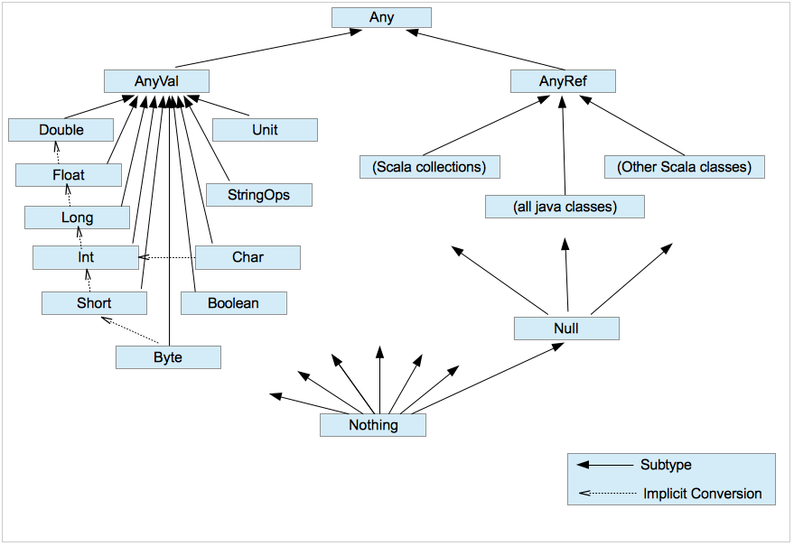

# CHAPTER 2. 데이터로 작업하기: 리터럴, 값, 변수, 타입

## :heavy_check_mark: 스칼라 데이터와 변수 타입
- 리터럴 (literal)
  - 소스 코드에 바로 등장하는 데이터
  - e.g. 숫자 5, 문자 A, 텍스트 'Hello'
- 값(value)
  - 불변의 타입을 갖는 저장 단위
  - 정의될 떄 데이터가 할당될 수 있지만, 절대 재할당될 수는 없다.
  - **val <식별자>[: <타입>] = <리터럴>**
  - e.g. `val x: Int = 5`
- 변수(variable)
  - 가변의 타입을 갖는 저장 단위
  - 정의 시 데이터를 할당할 수 있으며, 언제라도 데이터를 재할당할 수도 있다. 
  - **var <식별자>[: <타입>] = <리터럴>**
  - e.g. `var x: Int = 5`
- 타입(type)
  - 데이터의 종류, 데이터의 정의 또는 분류를 의미한다.
- 스칼라에서 값과 변수에 저장된 데이터를 더 이상 사용하지 않으면 자바 가상 머신(JVM)의 가비지 컬렉션(GC)이 자동으로 할당을 취소한다.

## :heavy_check_mark: 값(value)
- 불변의 타입을 갖는 저장 단위
- 정의될 떄 데이터가 할당될 수 있지만, 절대 재할당될 수는 없다.
- **val <식별자>[: <타입>] = <리터럴>**
  - e.g. `val x: Int = 5`
- 값은 이름과 할당된 데이터 모두 필요하지만, 명시적 타입이 있어야 하는 것은 아니다.
  - 즉, 값 정의에서의 타입 명시는 선택사항이다.
- 타입이 지정되지 않은 경우, 스칼라 컴파일러는 할당된 데이터를 기반으로 **타입을 추론(type inference)**한다.
  - 코드의 가독성을 떨어뜨리지 않는 범위에서 타입을 생략해도 된다.
  - 초깃값과 호환되지 않는 타입으로 값을 정의하면 컴파일 에러가 발생한다.

## :heavy_check_mark: 변수(variable)
- 가변의 타입을 갖는 저장 단위 
- 정의 시 데이터를 할당할 수 있으며, 언제라도 데이터를 재할당할 수도 있다. 
  - **var <식별자>[: <타입>] = <리터럴>**
  - e.g. `var x: Int = 5`
- 값과 마찬가지로 타입 명시는 선택사항이다. 
- 스칼라에서는 관례상 변수보다 값을 선호한다.
  1. 값을 사용하면 소스 코드가 안정적이며 예측할 수 있기 때문이다. 
  2. 값을 정의하면 다른 어떤 코드에서 접근하더라도 같은 값을 유지한다.
  3. 코드 시작 부분에 값을 할당하면 코드 마지막 부분까지 같은 값을 가지므로 코드를 읽고 디버깅하기 더 쉽다.
  4. 애플리케이션 수명 기간에 사용할 수 있거나 동시 또는 멀티 스레드 코드에서 접근 가능한 데이터로 작업하는 경우, 더 안정적이며 에러가 발생할 가능성도 작다.
- 변수가 더 적합한 경우
  - 임시 데이터를 저장하거나 루프 내에서 값을 누산하는 로컬 변수로 사용하는 경우 

### 명명 
- 대괄호([])와 마침표(.)를 제외한 모든 문자를 이름으로 사용할 수 있다.
- 값과 변수명은 관례상 소문자로 시작하고, 추가적인 단어는 대문자로 시작한다.
- CamelCase 을 권장한다.

#### 유효한 식별자를 만들기 위한 규칙
1. 하나의 문자 다음에는 + 아무것도 없거나/하나 이상의 문자 또는 숫자
  - e.g. `val name, val name2`
  - e.g. `val 3name` (X) // 숫자로 시작할 수 없음 
2. 1번 + 언더스코어(_) + 하나 이상의 문자 또는 숫자 또는 연산 기호 
  - e.g. `val name_name, val name_2, val name_*`
3. 하나 또는 그 이상의 연산자 기호
  - e.g. `*, π, ++`
4. 하나 또는 그 이상의 문자를 한 쌍의 역인용 부호(`)로 둘러쌈 
  - 역인용 부호에 둘러싸인 이름은 true, while, =, var 와 같은 키워드로 예약될 수 있다.

## :heavy_check_mark: 타입(type)
### 1. 숫자형 데이터 타입 
- 스칼라는 타입 순위에 기반하여 한 타입의 숫자를 자동으로 다른 타입으로 전환해준다.
- **Byte, Short, Int, Long, Float, Double**
  - Byte 타입이 최하위에 있어 다른 모든 타입으로 전환될 수 있다. 
- 스칼라는 높은 순위의 데이터 타입이 더 낮은 순위의 타입으로 자동 전환되는 것을 허용하지 않는다. 
  - 더 적은 저장 공간을 갖는 타입으로 전환하면 데이터 손실이 일어나게 되기 때문이다.
  - 수동으로 타입 전환을 하려면, `to<Type>` 메서드를 이용한다.
    - e.g. `val longData: Long = 20, val i: Int = longData.toInt` // longData가 Int의 저장 공간 범위 내에 있기 때문에 가능

### 2. 문자열 
- 스칼라의 String 은 자바의 String을 기반으로 하며, 여러 줄 리터럴과 문자열 보간 같은 고유의 특징을 추가했다.
- 숫자 타입과 마찬가지로 수학 연산자의 사용을 지원한다.
  - +: 문자열 합하기
  - ==: 문자열의 실제 두 값이 같은지 검사 (같으면 Boolean = true)

#### 특징 1. 여러 줄 리터럴
- 여러 줄의 String 은 큰 따옴표 세 개(""")를 이용하여 생성한다.
  - 여러 줄의 문자열은 리터럴이며, 이 문자열 안에 역슬래시가 있어도 인지하지 못한다.

#### 특징 2. 문자열 보간
- **포맷 1**
  - 문자열의 첫 큰따옴표 전에 접두사 's' 를 추가하여 표기한다. 
  - 그런 다음, 달러 기호($, with. 선택적 중괄호)로 외부 데이터에 대한 참조임을 표시한다.
  - e.g. `s"How do like thme ${"apple "*3}s?"`
- **포맷 2**
  - printf 표기법 사용: 문자 개수를 세거나 소수점 표시와 같은 데이터 서식을 제어하고자 할 때 유용
  - 문자열의 첫 큰따옴표 전에 접두사 'f' 를 추가하여 표기한다. 
  - 그런 다음, 참조 바로 뒤에 printf 표기법을 사용한다. 
  - e.g. `f"I wrote a new $item%.3s today"`

### 3. 숫자, 문자열 외의 핵심 타입

- 루트 
  - Any: 스칼라에서 모든 타입의 루트, 절대 루트 
  - AnyVal: 모든 값 타입의 루트
    - 객체로 힙 메모리에 할당되거나 JVM 기본값으로 스택에 지역적으로 할당된다.
  - AnyRef: 모든 참조(=값이 아닌) 타입의 루트
    - 오직 객체로 힙 메모리에 할당된다. 
- 최하위 
  - Nothing: 모든 타입의 하위 클래스
    - 다른 모든 타입의 서브타입
    - 프로그램 흐름에 심각하게 영향을 줄 수 있는 연산에서 호환성 있는 반환값을 제공하기 위해 존재한다. 
    - e.g. return 키워드는 반환 타입 Nothing 을 가지고 있어 값을 초기화하는 도중에 사용할 수 있다. 
  - Null: 널(null) 값을 의미하는 모든 AnyRef 타입의 하위 클래스
    - null 키워드에 타입을 제공하기 위해 존재한다. 
- Char: 유니코드 문자
- Boolean: 참 또는 거짓
- String: 문자열(텍스트)
- Unit: 값이 없음을 나타냄
- c.f. Char, Boolean, String 만 인스턴스화가 가능하다.

#### :link: Reference
- 

---

### :house: [LearningScala Home](https://github.com/WeareSoft/wwl/tree/master/study-contents/LearningScala)

### Reference
- 